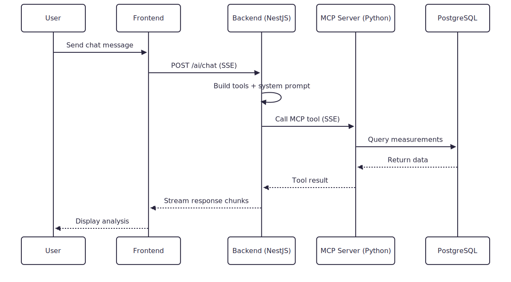

# Backend - NestJS API Server

NestJS 11 backend for data ingestion, measurements API, and AI integration.

## Data Flow



## Modules

```
src/
├── ingestion/        # Data ingestion with 8 parser strategies
├── measurements/     # Data query and retrieval API
├── ai/               # AI chat with MCP tool integration
└── database/         # TypeORM entities and configuration
```

## Parser Strategies



8 parsers auto-detect file format via `canHandle()` method:

| Parser | Detection | File Format | Golden Metrics |
|--------|-----------|-------------|----------------|
| Plexlog | `.s3db` or SQLite magic | SQLite | acproduction → Power |
| LTI | `[header]/[data]` markers | Text | P_AC → Power |
| Integra | `.xml` + root tag | XML | P_AC → Power |
| MeteoControl | `[info]` + `Datum=` | INI-style | Pac → Power |
| MBMET | `Zeitstempel` header | CSV (German) | Einstrahlung → Irradiance |
| Meier | `serial;` prefix | CSV | Feed-In_Power → Power |
| SmartDog | `B{}_A{}_S{}` pattern | CSV | pac → Power |
| GoodWe | Fallback | CSV (EAV) | Power, Energy |

## API Endpoints



### Ingestion
```
POST /ingest/:loggerType
  - Body: multipart/form-data (field: "files")
  - Supported: CSV, TXT, XML, SQLite (.s3db)
```

### Measurements
```
GET /measurements                      # List loggers
GET /measurements/:loggerId            # Get data (?start=&end=)
GET /measurements/:loggerId/date-range # Get date bounds
```

### AI Chat
```
POST /ai/chat                          # SSE streaming chat
GET /ai/status                         # Service status
```

## Database Schema


```typescript
@Entity('measurements')
- timestamp: Date (PK)
- loggerId: string (PK)
- loggerType: varchar(20)
- activePowerWatts: float
- energyDailyKwh: float
- irradiance: float
- metadata: jsonb
- createdAt: timestamptz
```

## Development

```bash
npm install
npm run start:dev     # Development with hot-reload
npm run start:prod    # Production build
```

## Testing

```bash
npm test              # Unit tests
npm run test:cov      # Coverage report
npm run test:e2e      # E2E tests
npm run test:watch    # Watch mode
```

## Environment Variables

```env
DB_HOST=localhost
DB_PORT=5432
DB_USERNAME=admin
DB_PASSWORD=admin
DB_DATABASE=pv_db

AI_PROVIDER=gemini
MCP_SERVER_URL=http://localhost:4000/sse
GOOGLE_GENERATIVE_AI_API_KEY=
```

## Key Dependencies

- `@nestjs/core` - NestJS framework
- `typeorm` + `pg` - PostgreSQL ORM
- `@ai-sdk/anthropic` - Vercel AI SDK
- `@modelcontextprotocol/sdk` - MCP client
- `multer` - File uploads
- `class-validator` - DTO validation

See [CLAUDE.md](../CLAUDE.md) for coding standards and architecture patterns.
