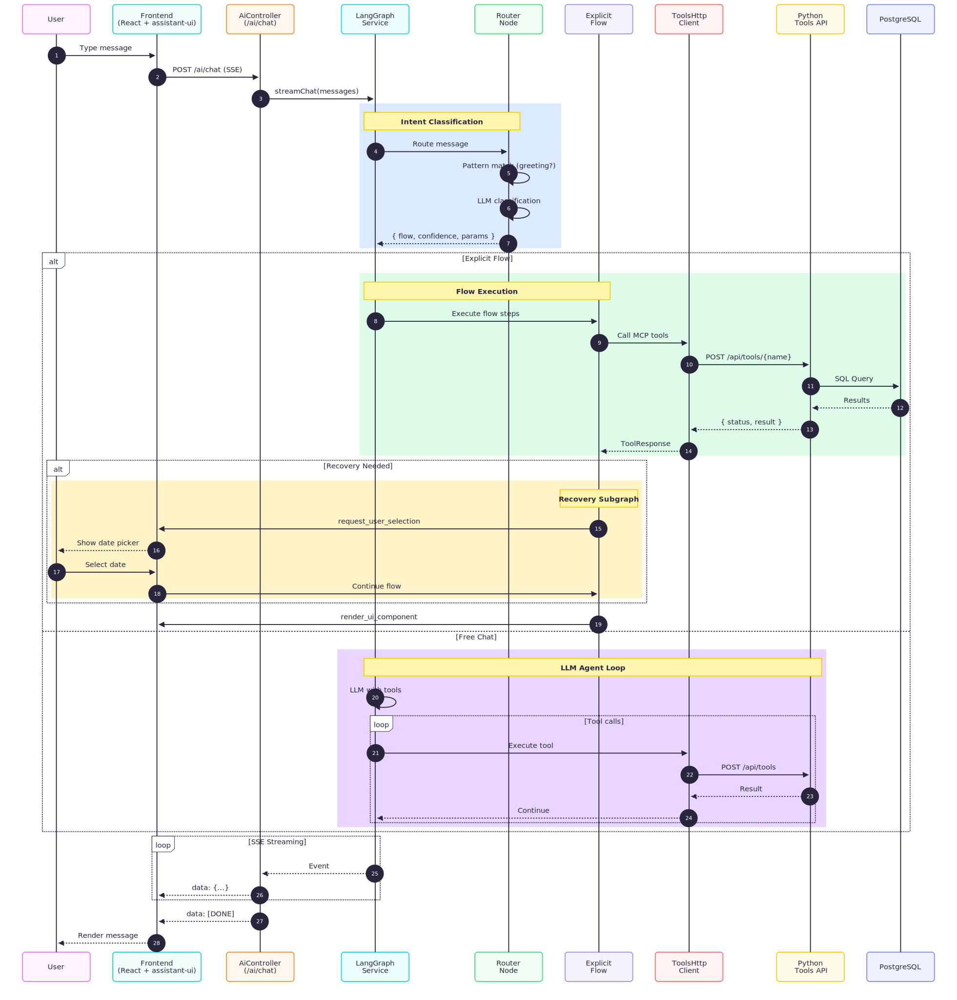

# AI Orchestration - LangGraph

LangGraph-based AI chat with explicit workflow orchestration and multi-provider LLM support.

## Architecture





```
src/ai/
├── ai.controller.ts        # POST /ai/chat (SSE streaming)
├── langgraph.service.ts    # StateGraph orchestrator
├── nodes/
│   ├── router.node.ts      # LLM intent classification
│   └── argument-check.node.ts
├── flows/                  # Explicit workflow implementations
│   ├── morning-briefing.flow.ts
│   ├── financial-report.flow.ts
│   ├── performance-audit.flow.ts
│   └── health-check.flow.ts
├── subgraphs/
│   └── recovery.subgraph.ts
├── narrative/              # Context-aware response generation
├── response/               # UI component builders (Zod-validated)
└── types/flow-state.ts     # ExplicitFlowStateAnnotation
```

## Architectural Decisions

### 1. Hybrid Flow Architecture
**Explicit deterministic flows** for structured tasks + **free chat LLM fallback** for general queries.

- Prevents hallucination in structured workflows
- Router classifies intent → routes to appropriate flow
- Falls back to LLM agent loop for unrecognized queries

### 2. Pass-Through Tools
`render_ui_component` and `request_user_selection` bypass backend execution.

- Frontend renders components directly from tool arguments
- Prevents infinite loops (these tools are terminal actions)
- Reduces round-trip latency for UI rendering

### 3. Recovery Subgraph
Centralized handling of data availability errors.



| Status | Handling |
|--------|----------|
| `no_data_in_window` | Date picker with `availableRange` constraints |
| `no_data` | Suggest alternative loggers or upload prompt |
| `error` | User-friendly error message |

- Max 3 retry attempts (prevents infinite loops)
- Global subgraph shared by all flows

### 4. SSE Streaming with Deduplication
Prevents duplicate events when using LangGraph checkpointing.

- Pre-fills reported set with incoming message IDs
- Content hashing for flow messages
- Tool call ID tracking across events

### 5. Multi-Provider LLM Abstraction

| Provider | Model | Environment Variable |
|----------|-------|---------------------|
| Gemini (default) | gemini-2.0-flash | `GOOGLE_GENERATIVE_AI_API_KEY` |
| Anthropic | claude-3-5-sonnet | `ANTHROPIC_API_KEY` |
| OpenAI | gpt-4o | `OPENAI_API_KEY` |
| Ollama | configurable | `OLLAMA_BASE_URL`, `OLLAMA_MODEL` |

### 6. Narrative Engine
Zod-validated context-aware response generation with branching logic.

- Time-of-day aware greetings
- Severity-based messaging (anomaly count, performance spread)
- UI component hints embedded in responses

### 7. Tool Call Contract Enforcement



LLM providers (OpenAI, Anthropic, Gemini) expect every `tool_call` to have a matching `ToolMessage` response.

**Problem**: When user responds to a selection prompt, we need to satisfy the pending `request_user_selection` tool call.

**Solution** (`router.node.ts:396-488`):
```typescript
// STRICT ID MATCHING: Only create ToolMessage if we have a valid tool call ID
const pendingToolCall = lastAiMessage?.tool_calls?.find(
  (tc) => tc.name === 'request_user_selection',
);

if (pendingToolCall?.id) {
  toolMessage = new ToolMessage({
    tool_call_id: pendingToolCall.id,
    content: JSON.stringify({ selection, selectedFor: waitingFor }),
    name: 'request_user_selection',
  });
}
```

### 8. Virtual Tool Handling



`render_ui_component` and `request_user_selection` have **no backend implementation** - they're rendered directly by the frontend.

**Problem**: Routing to ToolNode would cause "tool not found" errors and infinite loops.

**Solution** (`langgraph.service.ts:343-406`):

1. **`shouldContinue()`** - Detects virtual-only tool calls:
   ```typescript
   const onlyVirtualTools = toolCalls.every(
     (tc) => tc.name === 'render_ui_component' || tc.name === 'request_user_selection',
   );
   if (onlyVirtualTools) return 'end';  // Skip tools node
   ```

2. **`shouldRecover()`** - Detects terminal UI tools after execution:
   ```typescript
   const hasTerminalUiTool = toolCalls.some(
     (tc) => tc.name === 'render_ui_component' || tc.name === 'request_user_selection',
   );
   if (hasTerminalUiTool) return 'end';  // Break the loop
   ```

## Graph Structure

```
START → router → [conditional routing]
                 ├─ morning_briefing → ... → END
                 ├─ financial_report → ... → END
                 ├─ performance_audit → ... → END
                 ├─ health_check → ... → END
                 └─ free_chat → tools → check_results → [recovery | llm | END]
```

**Router Node**: Two-tier classification
1. **Tier 1**: Regex pattern matching for greetings (no LLM call)
2. **Tier 2**: LLM classification with Zod-validated extraction

## Explicit Flows

### Morning Briefing
**Trigger**: "Fleet overview", "How is the site?", "Status report"



```
fleet_overview → check_critical → diagnose_issues (if offline) → render_briefing
```

| Step | Tool | Output |
|------|------|--------|
| Fleet overview | `get_fleet_overview` | Total power, energy, device status |
| Check critical | — | Evaluate offline device count |
| Diagnose issues | `diagnose_error_codes` | Error codes for offline devices |
| Render briefing | `render_ui_component` | FleetOverview card + narrative |

---

### Financial Report
**Trigger**: "How much did I save?", "ROI", "Savings report"



```
fetch_loggers → check_args → calculate_savings → forecast → render_report
```

| Step | Tool | Output |
|------|------|--------|
| Fetch loggers | `list_loggers` | Available inverters |
| Check args | — | Validate logger selection (prompt if missing) |
| Calculate savings | `calculate_financial_savings` | 30-day savings, CO2 offset |
| Forecast | `forecast_production` | 7-day production forecast |
| Render report | `render_ui_component` | FinancialReport card |

---

### Performance Audit
**Trigger**: "Compare inverters", "Efficiency check", "Which is best?"



```
fetch_loggers → check_args → compare → render_chart
```

| Step | Tool | Output |
|------|------|--------|
| Fetch loggers | `list_loggers` | Available inverters |
| Check args | — | Validate 2-5 loggers selected (multi-select prompt) |
| Compare | `compare_loggers` | Power metric comparison |
| Render chart | `render_ui_component` | ComparisonChart with best/worst analysis |

---

### Health Check
**Trigger**: "Check anomalies", "Any problems?", "Health status"



```
fetch_loggers → check_args → analyze_health → render_report
```

| Step | Tool | Output |
|------|------|--------|
| Fetch loggers | `list_loggers` | Available devices |
| Check args | — | Validate selection (supports "all devices") |
| Analyze health | `analyze_inverter_health` | 7-day anomaly detection |
| Render report | `render_ui_component` | HealthReport or FleetHealthReport |

## State Annotation

```typescript
ExplicitFlowStateAnnotation {
  messages: BaseMessage[]           // LangChain message history
  recoveryAttempts: number          // Max 3 retries
  pendingUiActions: ToolCall[]      // Pass-through tools
  activeFlow: FlowType              // Current workflow
  flowStep: number                  // Position in flow (0-5)
  flowContext: {
    selectedLoggerId?: string
    selectedLoggerIds?: string[]
    dateRange?: { start, end }
    electricityRate?: number
    previousFleetStatus?: FleetStatusSnapshot
  }
}
```

## Tool Integration

### MCP Tools (via HTTP to Python service)
10 tools called via `ToolsHttpClient`:
- Discovery: `list_loggers`, `get_fleet_overview`
- Monitoring: `analyze_inverter_health`, `get_power_curve`, `compare_loggers`
- Financial: `calculate_financial_savings`, `calculate_performance_ratio`, `forecast_production`
- Diagnostics: `diagnose_error_codes`, `health_check`

### Pass-Through Tools (frontend-rendered)
- `render_ui_component`: Render charts, cards, reports
- `request_user_selection`: Dropdowns, date pickers

## Development

```bash
npm test                    # Unit tests
npm run test:e2e            # E2E tests
npm run test:watch          # Watch mode
```

### Key Test Files
- `langgraph.service.spec.ts` - Unit tests
- `langgraph.service.e2e.spec.ts` - End-to-end tests
- `flows/*.spec.ts` - Per-flow tests
- `test-utils/` - Fake models, mock tools, SSE capture

## Related Documentation

- [AI_UX_FLOWS.md](../../../AI_UX_FLOWS.md) - Complete flow specifications
- [ai/README.md](../../../ai/README.md) - Python tools API
- [Agent Behavior](../../../diagrams/svg/agent-behavior.svg) - Router classification logic
- [Router Logic](../../../diagrams/markdown/router-logic.md) - Selection handling and ToolMessage injection
- [Tool Execution](../../../diagrams/markdown/tool-execution.md) - Virtual vs real tool handling
