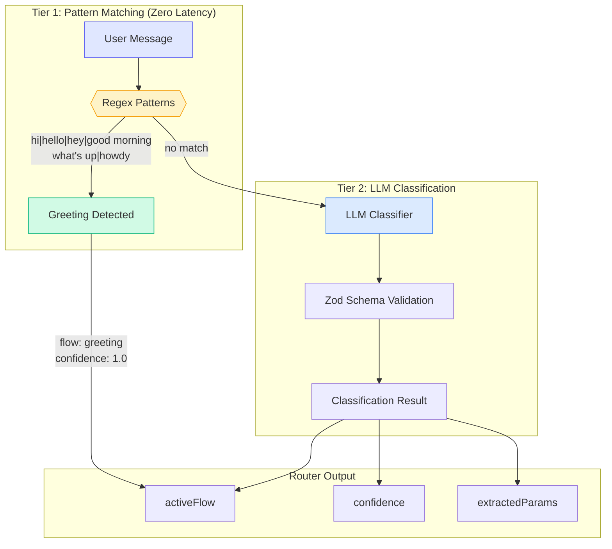
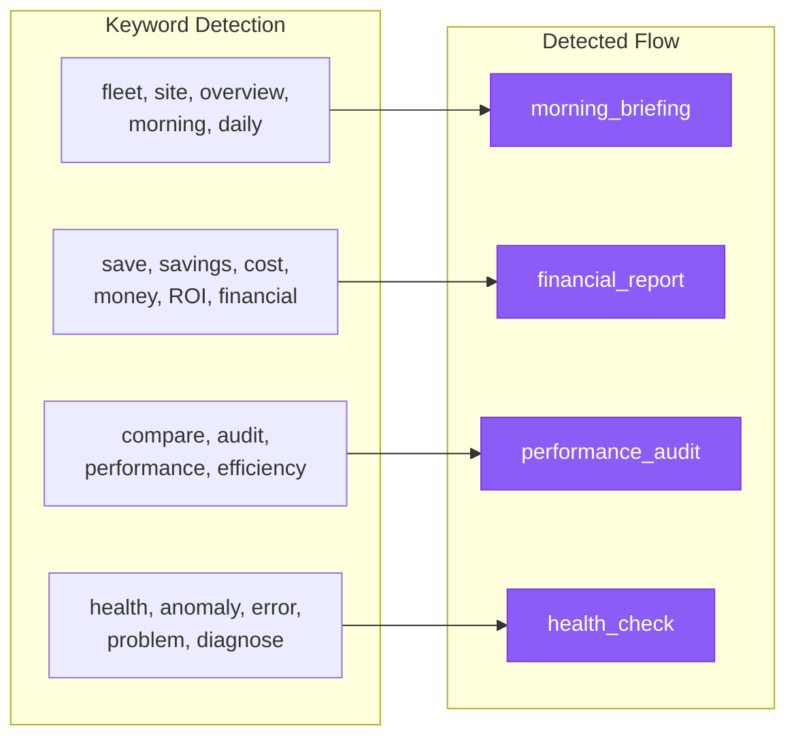
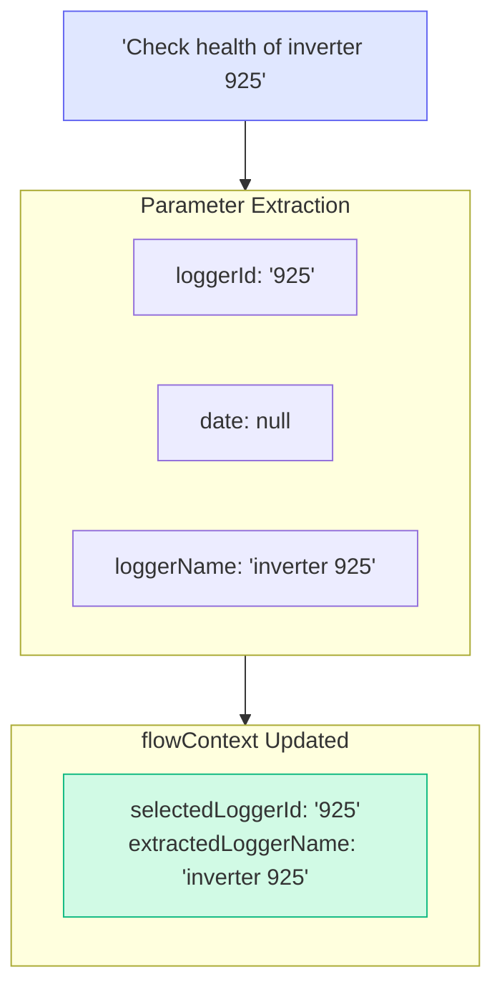
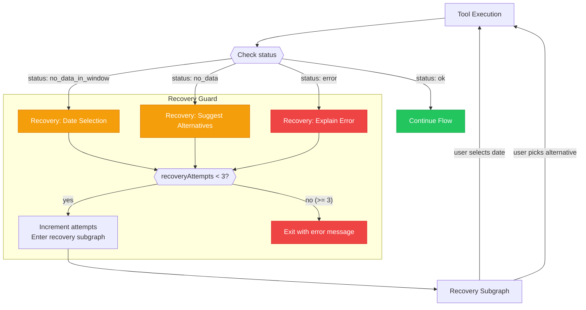
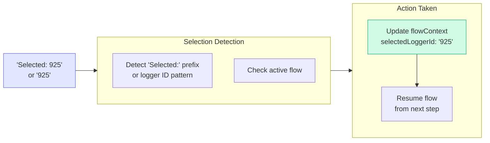

# Agent Behavior

How the AI agent makes decisions: two-tier router classification, intent detection logic, parameter extraction, and recovery decision tree.

## Two-Tier Router Classification

## Intent Detection Logic

## Parameter Extraction

The router extracts parameters during classification to avoid redundant queries:

## Recovery Decision Tree

## Selection Response Detection

When user responds to a selection prompt:

## Confidence Thresholds

| Confidence | Action |
|------------|--------|
| `>= 0.9` | High confidence, proceed directly to flow |
| `0.7 - 0.9` | Medium confidence, proceed but watch for corrections |
| `< 0.7` | Low confidence, fall back to free_chat |
| `1.0` (regex) | Greeting pattern matched, bypass LLM |
