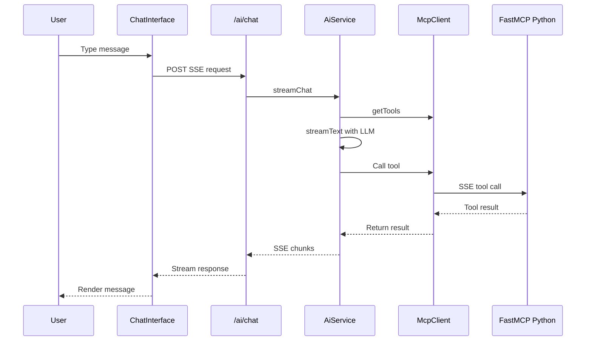

# AI Chat Flow

Sequence diagram for AI chat SSE streaming flow from User through ChatInterface to AiService to FastMCP Python server.

[Edit in Mermaid Chart Playground](https://mermaidchart.com/play?utm_source=mermaid_mcp_server&utm_medium=remote_server&utm_campaign=claude#pako:eNptkMFOwzAQRH9llXvVew6VKgNSpEZYODlE6sVyl8QidYK9ASrEv7NOUgI0Pu6b2RnvZ2K6EyZpEvB1QGfwzura6_PRAb9ee7LG9toRlKADlAH9LRJZZKLRlDlC_6wN3or2clRttd0aVq4IVOR7q9C_2bUNuZBRkZtetBbdygpZRcGDDhS18kJN545u0pWb3U5kKRSXHuGMIeh6zhAZI66XgnxUBSh1Dz5eI8wJjKJApRDIoz6Ln_p7xYCjUqiRiq5rw6_5Yijwg-DdUgOHQ_7fKXTbArF3AjxjIqt07BHnYFgxQVltrraYxjXD0NJinFOfkAbv_lDOu34y7jXN4F7C8r35NmqsG41958JyHsZlXOtO6K-3S76-AfcKs7U)
