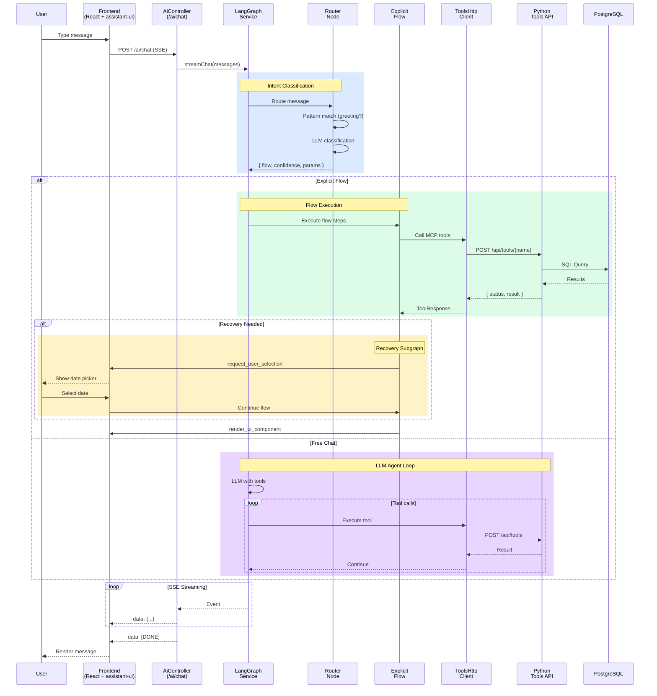
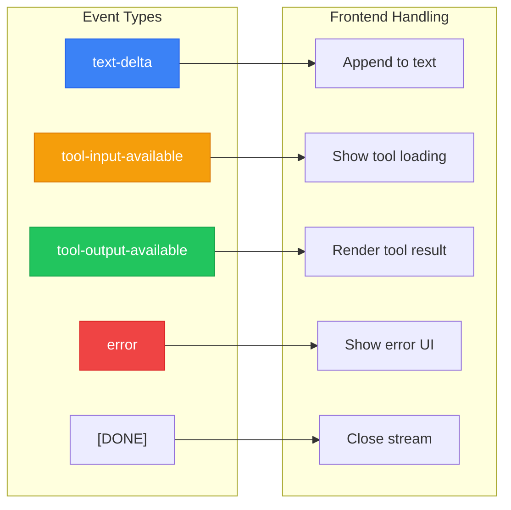
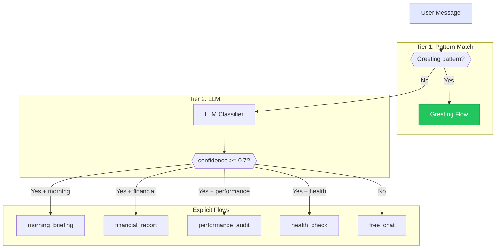
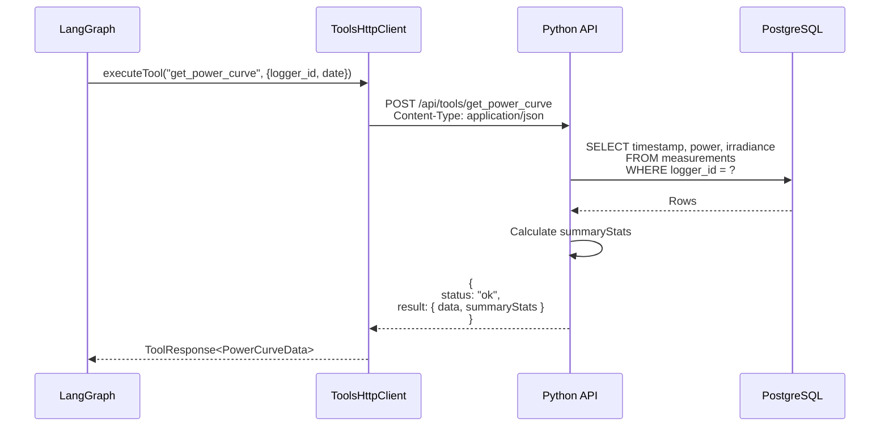
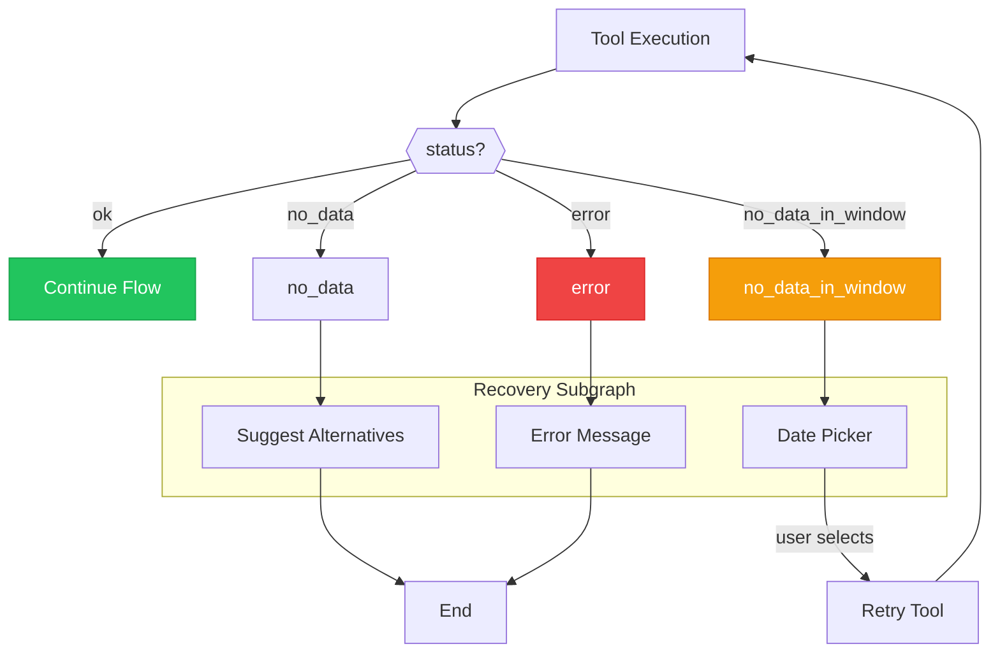

# AI Chat Flow

Complete sequence diagram for AI chat SSE streaming flow from User through the full stack, including LangGraph router, explicit flows, tool execution, and recovery handling.

## Overview Sequence

## SSE Event Types

## Router Classification Flow

## Tool Execution Detail

## Recovery Flow

## Related Diagrams

- [LangGraph Main Graph](./langgraph-main-graph.md) - Complete StateGraph structure
- [SSE Streaming](./sse-streaming.md) - Detailed streaming implementation
- [Recovery Subgraph](./recovery-subgraph.md) - Error recovery details
- [Frontend Tool Rendering](./frontend-tool-rendering.md) - UI component hierarchy
