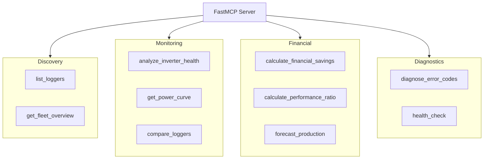

# AI Tools

MCP tools hierarchy diagram showing FastMCP server with tool categories: Discovery, Monitoring, Financial, Diagnostics.

[Edit in Mermaid Chart Playground](https://mermaidchart.com/play?utm_source=mermaid_mcp_server&utm_medium=remote_server&utm_campaign=claude#pako:eNp1ksFOwzAQRH8lyr0_wIEDoN4qIcGtraxls3EsXG-0dhIVxL-zJWrsQPEhkWY2nqfZfNbIDdV3det5wg4kVa8Ph1Dp2T0-77cQk76rF5KR5HgIi1VtNvfVk4vIapzX8o6DSywu2LW-dQECOvC_bwEbOCaH8RoQhzcr0Hc5YX-oc1p9nMcux7uYjGdrSWJWLSXTetLn5YvR0TR7FJo_GRlXQwr2MgUC-PMHGRf0ukRiOgKfunVgz5M6OGhX2UA-9SC0RryFsbSjFLmpEgLB4-AhkWmvvokwKmu8NdSTtCwnHSQjkBznIdUJdbemF24GVC_8D1bs52cLeVslXDPrZEiEtQX9rQqquS6DHeH7klR_fQPRtdME)
