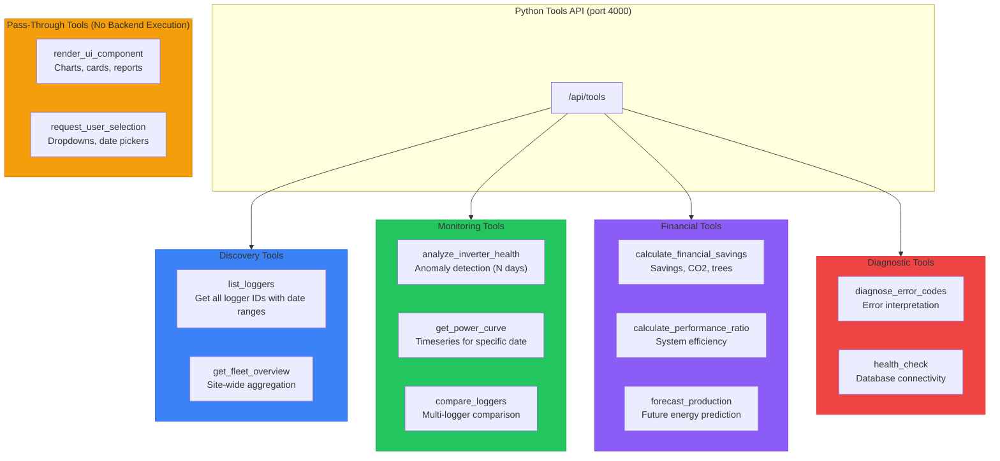
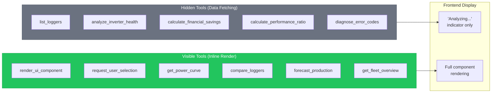
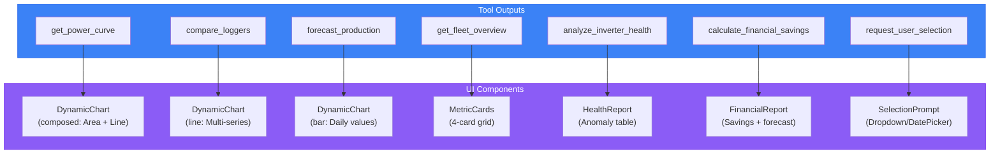
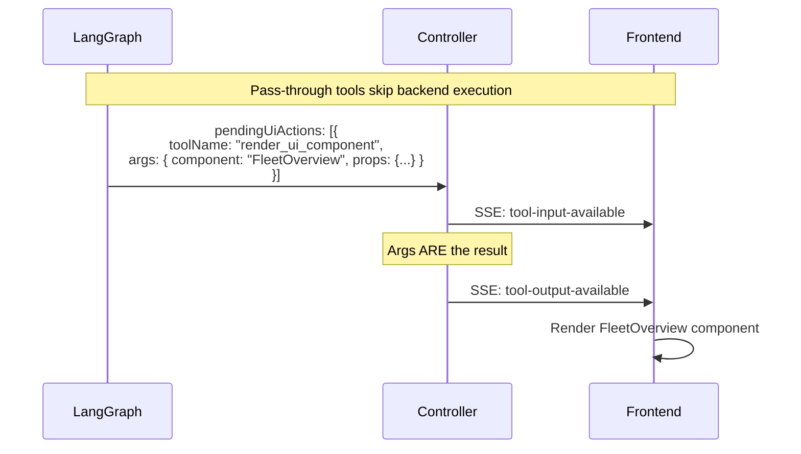
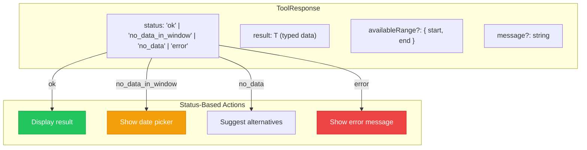

# AI Tools

MCP tools hierarchy diagram showing the Python FastMCP server with tool categories, pass-through tools for UI rendering, and tool-to-component mapping.

## Tool Categories

## Tool Visibility

## Tool to Component Mapping

## Pass-Through Tool Flow

## Tool Response Schema

## Tool Parameters Summary

| Tool | Required Params | Optional Params | Returns |
|------|-----------------|-----------------|---------|
| `list_loggers` | - | - | Logger[] with date ranges |
| `get_fleet_overview` | - | - | Power, energy, % online |
| `analyze_inverter_health` | `logger_id` | `days` (default: 7) | Anomalies, health score |
| `get_power_curve` | `logger_id`, `date` | - | Timeseries + summaryStats |
| `compare_loggers` | `logger_ids[]`, `metric` | `date` | Multi-logger data |
| `calculate_financial_savings` | `logger_id` | `start_date`, `end_date`, `rate` | Savings, CO2, trees |
| `calculate_performance_ratio` | `logger_id`, `date` | `capacity_kw` | Efficiency metrics |
| `forecast_production` | `logger_id` | `days_ahead` (default: 7) | Daily forecasts |
| `diagnose_error_codes` | `logger_id` | `days` (default: 7) | Error interpretations |
| `render_ui_component` | `component`, `props` | `suggestions` | (pass-through) |
| `request_user_selection` | `prompt`, `inputType` | `options`, `flowHint` | (pass-through) |

## Related Diagrams

- [LangGraph Main Graph](./langgraph-main-graph.md) - How tools integrate with flows
- [Frontend Tool Rendering](./frontend-tool-rendering.md) - UI component hierarchy
- [Recovery Subgraph](./recovery-subgraph.md) - Error handling with status codes
