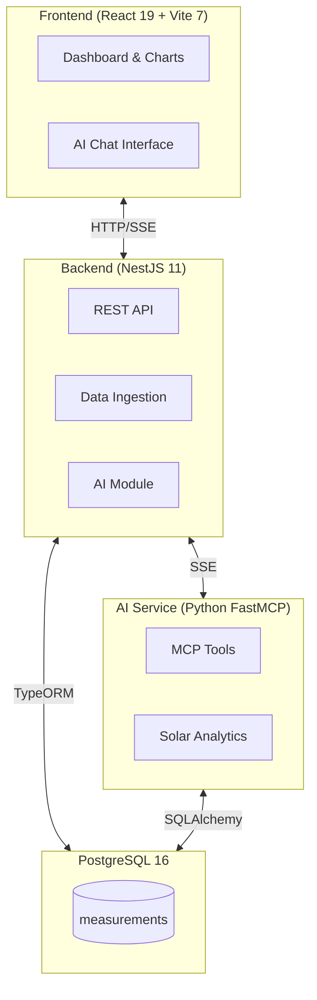

# Architecture Overview

High-level three-tier architecture diagram for PV Monitoring Platform.

[Edit in Mermaid Chart Playground](https://mermaidchart.com/play?utm_source=mermaid_mcp_server&utm_medium=remote_server&utm_campaign=claude#pako:eNp9kV1LwzAUhv_KoRejQ4b0RlFB6L4wsmm3VG9SL7I0W4tdMpJMKc7_brp-TmWBknNOnnPel9Mvh8mYO7fOOpOfLKHKQDiMBNij96uNorsEpkoKw0VMIqcOwV1yygx4N3ABr6nhcN2PnLeysTgviIypTlaSqhh6MCom6867LRjio-MNyM5Ua8p4BViBSPwyMaTsvfRQReA-cW0eMXjeqbQfILKc4LAIOmUkNpZPpbDGDG3TbicqLM1lvM_OWfER5uojZdyasXyVgBvkJpECplSb-Sg4NWULxH4QSpl19-ALmuUmZZpgmVHV5mf0C_8rqgv5QGqzURwvZuBdnQiOh8Tdcqr3im-5MLr_d2DzM3uZuRsM7g8PYRhcYjw51NsuuXrhNXYkmiX8z4T5jj8v54fGbIk1Xe2wxczPWMK3ecs63z9ehs9P)
