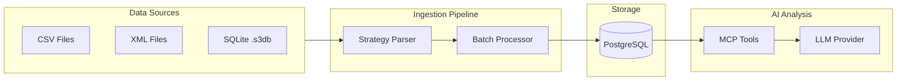

# Data Flow

Data flow diagram showing data ingestion from CSV/XML/SQLite through parser to database, and AI query flow.

[Edit in Mermaid Chart Playground](https://mermaidchart.com/play?utm_source=mermaid_mcp_server&utm_medium=remote_server&utm_campaign=claude#pako:eNp9UcFqxCAQ_RXx1D1sL731UNhsKCwYsGspBdODm0yNEDQ4pmUp_fcaDUvClh0YfeMM773BH9q4Fugj_ezdd9MpHwg71pbEwPGkvRo6crDDGGRNSxUUEW70DWBNP_LUFHvxJmOSZ9MDLt7fKyZjXr2LF2YCyHyRe3xoT3MXbFvbK3kNGIyz0cIFE24G6I2FlRGuPIKXIngVQJ_nejFQqNB0Mp2EexcXQedvaIvgvNIQlWe0kisLeccdBu0h7rK5wbOzqj-jwUi0O1yqFdmrcz3Kas8zWnQYq2TMyfCXaeEfv-mHyHb7NG-cYN5yQmWRx8oilYk_ochKf_8AvaafQA)
