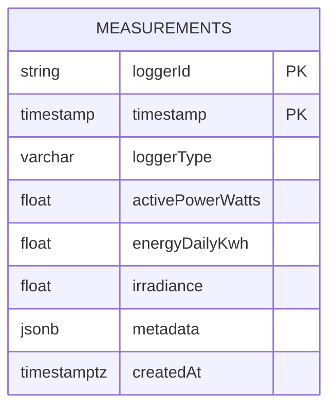

# Database Schema

Entity relationship diagram for the measurements table in PostgreSQL.

[Edit in Mermaid Chart Playground](https://mermaidchart.com/play?utm_source=mermaid_mcp_server&utm_medium=remote_server&utm_campaign=claude#pako:eNptzsEKgzAMBuBXKX2M3QQ9DHHIdOyyS9ZmtcO2kgbFie--DQeK7D-FfPwhk1RBozxIpNSCIXA3Lz4psqS6nLMiO9WVmJbdN5HJeiPaYAzSUYsyX42tw8jgus209R5INUC_cj12uNqjDcACFNseyzAgXYE57h09khlTsO2YD81eLRFoC15t7j5j8HfhkEEDw59f-SUUITDqhBee5fwGNURXpQ)
