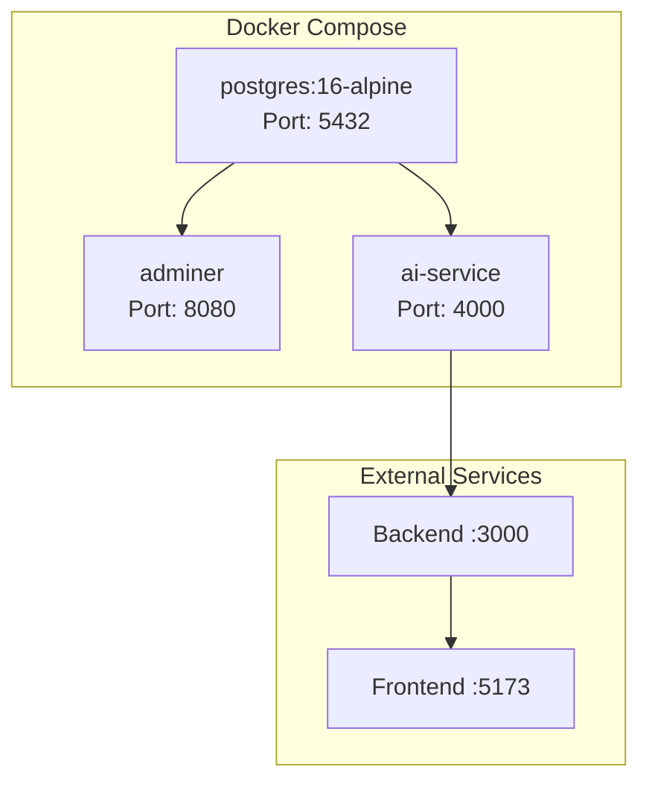

# Docker Deployment

Docker Compose service topology showing PostgreSQL, Adminer, AI Service containers with ports and dependencies.

[Edit in Mermaid Chart Playground](https://mermaidchart.com/play?utm_source=mermaid_mcp_server&utm_medium=remote_server&utm_campaign=claude#pako:eNptj0FvgzAMhf9KlMNuqFDKVjGpUlNCxQ1pu40dAqQtKk2Qk66Vqv73GaJpS7V38rM_P8s32uhW0pTuen1pDgIseWeVIihzrvcghgPJdHOU8FFRV5CNPg3ayIp-OnBUucU5du0epEmj50D0Q6fkU29fa5itSg02Jckinntb6wy3RHtCEnx0GS5DHy1GtAuMhK-ueQhehOEvLVVbqYcX-NVKUKLHjJ-SvLkk451hHBEm8E_VkjT-mzsqH8c5aGWneRK9xP_dLbckCFb4nm8LZ9fFZBl3lvHJ5pzevwFIH3Og)
