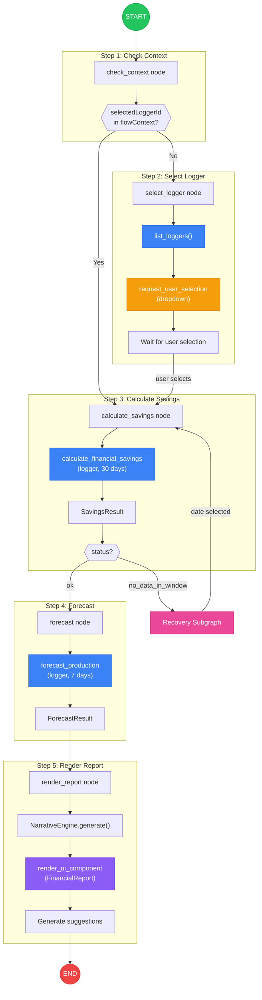
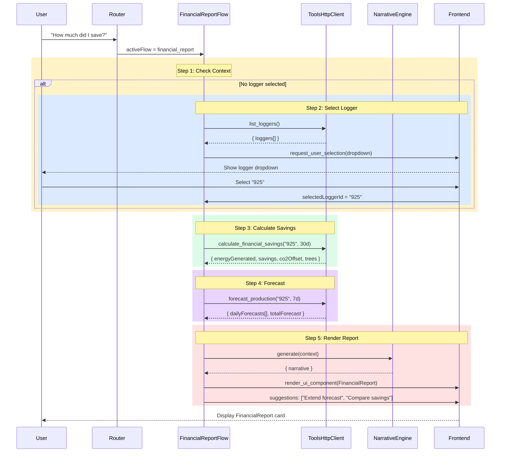
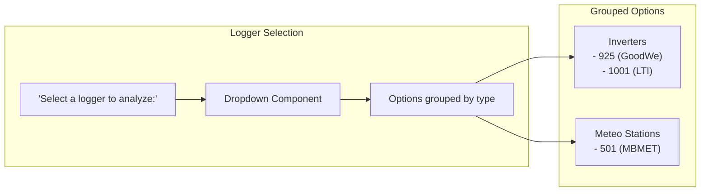
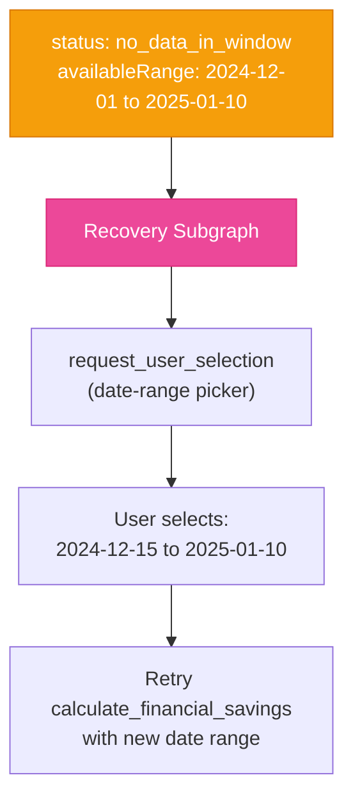

# Financial Report Flow

Detailed flow diagram for the financial report workflow: savings calculation with optional logger selection and production forecast.

## Flow Graph



## Sequence Diagram



## Data Schemas

### SavingsResult
```typescript
interface SavingsResult {
  energyGenerated: number;    // kWh generated in period
  savings: number;            // $ saved
  co2Offset: number;          // kg CO2 avoided
  treesEquivalent: number;    // Trees equivalent
  periodStart: string;        // ISO date
  periodEnd: string;          // ISO date
  electricityRate: number;    // $/kWh used
}
```

### ForecastResult
```typescript
interface ForecastResult {
  dailyForecasts: {
    date: string;
    predicted: number;        // kWh
    low: number;              // Lower bound
    high: number;             // Upper bound
    confidence: number;       // 0-1
  }[];
  totalForecast: number;      // Total kWh
  methodology: string;        // Algorithm used
}
```

## Logger Selection UI



## Recovery Handling

If `calculate_financial_savings` returns `no_data_in_window`:



## Generated Suggestions

| Scenario | Suggestions |
|----------|-------------|
| Forecast generated | "Extend forecast to 30 days", "Compare with other loggers" |
| High savings | "View power curve", "Check performance ratio" |
| Low savings | "Diagnose issues", "Check maintenance schedule" |
