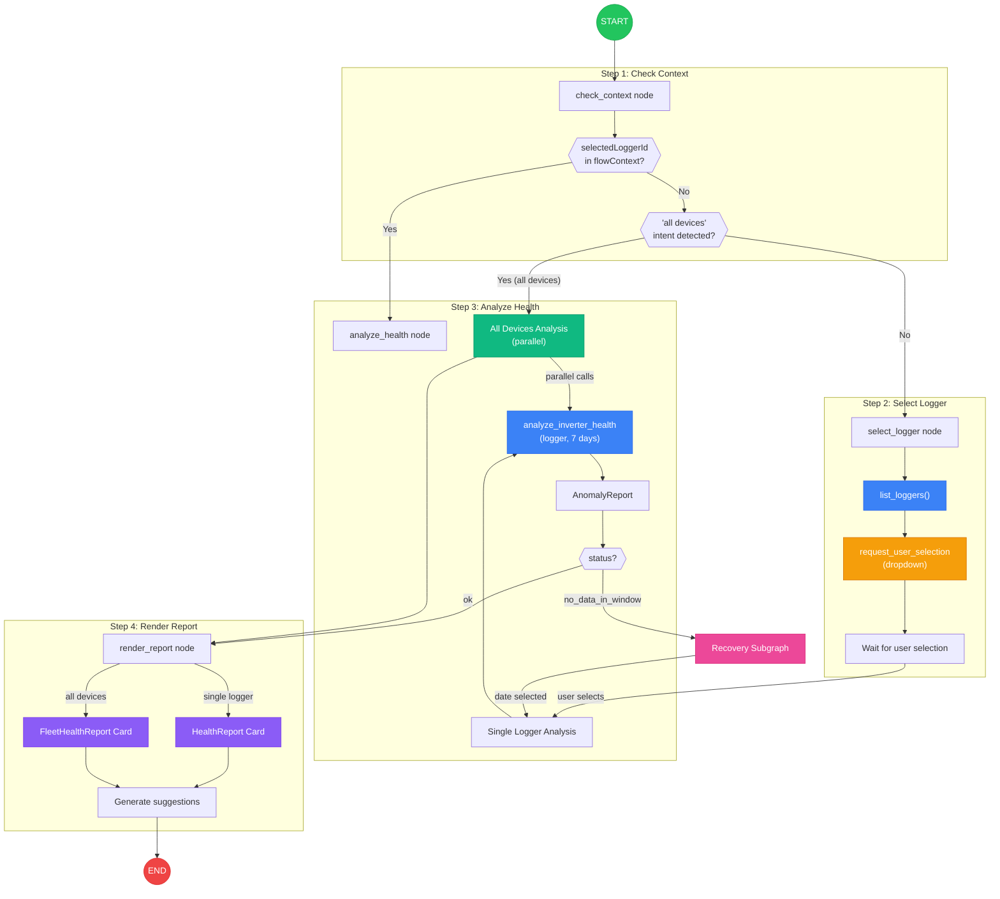
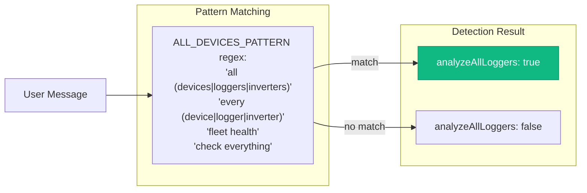
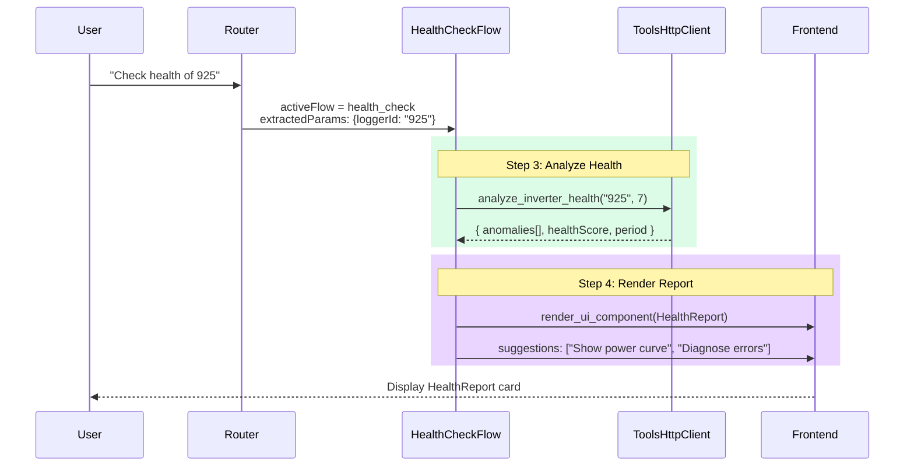
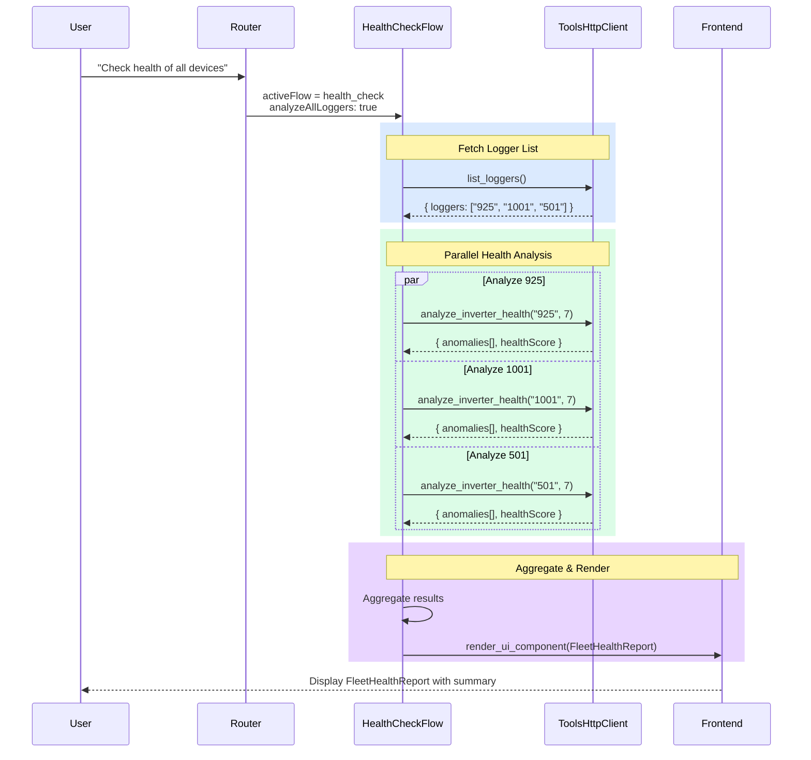
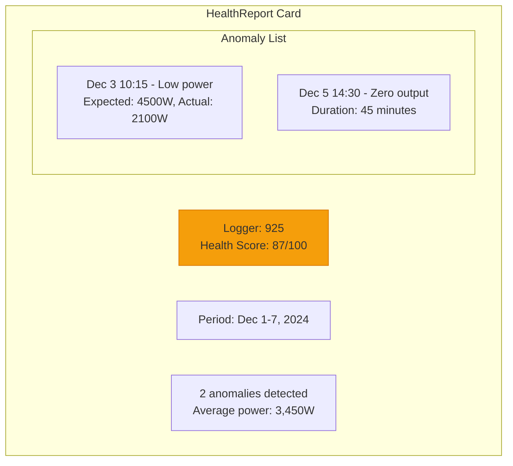
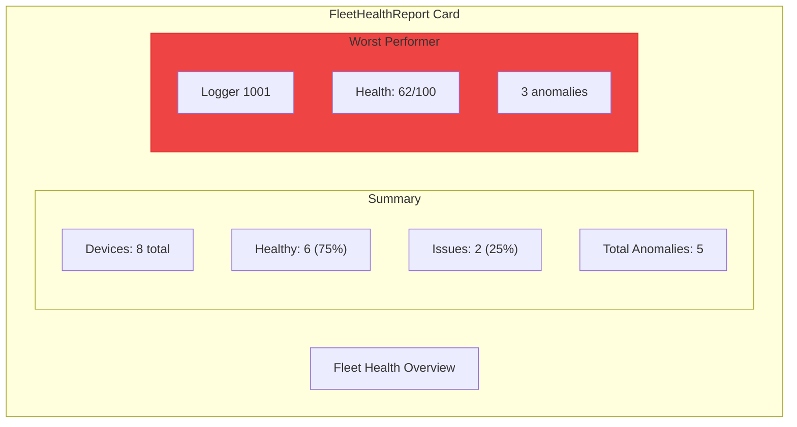

# Health Check Flow

Detailed flow diagram for the health check workflow: anomaly detection with support for single logger or all-devices analysis.

## Flow Graph



## All-Devices Mode Detection



## Sequence Diagram - Single Logger



## Sequence Diagram - All Devices



## Data Schemas

### AnomalyReport (Single Logger)
```typescript
interface AnomalyReport {
  loggerId: string;
  period: { start: string; end: string };
  anomalies: Anomaly[];
  healthScore: number;        // 0-100
  avgPower: number;
  expectedPower: number;
  deviationPercent: number;
}

interface Anomaly {
  timestamp: string;
  type: 'low_power' | 'zero_output' | 'erratic' | 'overcurrent';
  severity: 'warning' | 'critical';
  value: number;
  expected: number;
  description: string;
}
```

### FleetHealthReport
```typescript
interface FleetHealthReport {
  analyzedAt: string;
  totalDevices: number;
  healthyDevices: number;
  devicesWithIssues: number;
  totalAnomalies: number;
  avgHealthScore: number;
  deviceReports: AnomalyReport[];
  worstPerformer?: {
    loggerId: string;
    healthScore: number;
    anomalyCount: number;
  };
}
```

## UI Components

### Single Logger: HealthReport Card


### All Devices: FleetHealthReport Card


## Generated Suggestions

| Scenario | Suggestions |
|----------|-------------|
| Anomalies found | "Show power curve for anomaly dates", "Diagnose error codes" |
| No anomalies | "Compare with other loggers", "View historical trends" |
| Fleet analysis | "Check worst performer", "Export health report" |
| Critical anomalies | "Schedule maintenance", "Contact support" |
