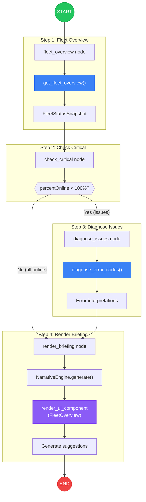
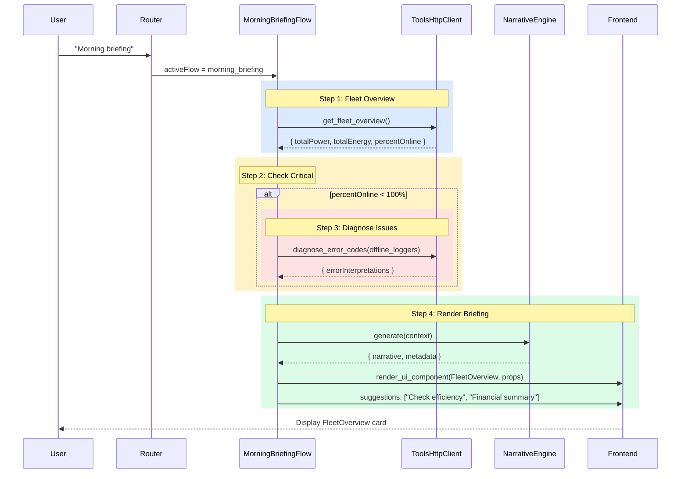
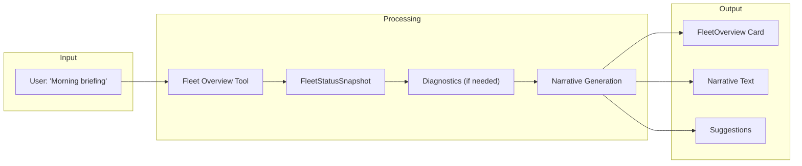

# Morning Briefing Flow

Detailed flow diagram for the morning briefing workflow: fleet overview with automatic critical alert detection and diagnostics.

## Flow Graph



## Sequence Diagram



## Data Flow



## FleetStatusSnapshot Schema

```typescript
interface FleetStatusSnapshot {
  timestamp: string;          // When snapshot was taken
  totalPower: number;         // Current total power (W)
  totalEnergy: number;        // Today's energy (kWh)
  deviceCount: number;        // Total devices
  onlineCount: number;        // Online devices
  percentOnline: number;      // % online
  avgIrradiance?: number;     // Average irradiance (W/m²)
  alerts?: Alert[];           // Critical alerts
}
```

## Generated Suggestions

| Condition | Suggestions |
|-----------|-------------|
| All devices online | "Check efficiency", "Financial summary" |
| Some devices offline | "Diagnose offline devices", "Show error details" |
| Low power output | "Check weather conditions", "Compare to yesterday" |

## Narrative Context

The NarrativeEngine receives context for generating consultant-quality text:

```typescript
{
  flowType: 'morning_briefing',
  subject: 'fleet',
  data: FleetStatusSnapshot,
  dataQuality: {
    completeness: 1.0,
    expectedWindow: 'today',
    actualWindow: 'today'
  },
  isFleetAnalysis: true,
  previousFleetStatus?: FleetStatusSnapshot  // For temporal comparison
}
```
