# Performance Audit Flow

Detailed flow diagram for the performance audit workflow: multi-logger comparison with metric selection and best/worst performer analysis.

## Flow Graph


## Sequence Diagram


## Multi-Select UI

```mermaid
flowchart TB
    subgraph Selection["Logger Multi-Select"]
        PROMPT["Select 2-5 loggers to compare:"]

        subgraph Checkboxes["Checkbox List"]
            CB1["☑ 925 (GoodWe) - Dec 1-15"]
            CB2["☑ 1001 (LTI) - Dec 1-15"]
            CB3["☑ 1002 (Meier) - Dec 1-15"]
            CB4["☐ 501 (MBMET) - Dec 1-15"]
        end

        VALIDATE["Validation: 2-5 required"]
        SUBMIT["Submit Selection"]
    end

    PROMPT --> Checkboxes
    Checkboxes --> VALIDATE
    VALIDATE -->|"valid"| SUBMIT

    style CB1 fill:#d1fae5,stroke:#10b981
    style CB2 fill:#d1fae5,stroke:#10b981
    style CB3 fill:#d1fae5,stroke:#10b981
```



## Analysis Helpers

### computeBestPerformer()


### computeSpreadPercent()


### computeComparisonSeverity()


## Data Schemas

### ComparisonResult
```typescript
interface ComparisonResult {
  metric: 'power' | 'energy' | 'irradiance';
  period: { start: string; end: string };
  loggers: LoggerComparison[];
}

interface LoggerComparison {
  loggerId: string;
  loggerType: string;
  data: DataPoint[];
  avgValue: number;
  peakValue: number;
  totalEnergy?: number;
}

interface DataPoint {
  timestamp: string;
  value: number;
}
```

### Analysis Output
```typescript
interface ComparisonAnalysis {
  bestPerformer: {
    loggerId: string;
    avgValue: number;
  };
  worstPerformer: {
    loggerId: string;
    avgValue: number;
  };
  spreadPercent: number;
  severity: 'similar' | 'moderate_difference' | 'large_difference';
}
```

## ComparisonChart UI

```mermaid
flowchart TB
    subgraph Chart["ComparisonChart Component"]
        HEADER["Performance Comparison<br/>December 15, 2024"]

        subgraph Lines["Multi-Line Chart"]
            L1["--- 925 (blue)"]
            L2["--- 1001 (green)"]
            L3["--- 1002 (orange)"]
        end

        subgraph Analysis["Analysis Panel"]
            BEST["🏆 Best: 925 (4,520W avg)"]
            WORST["⚠️ Worst: 1002 (3,200W avg)"]
            SPREAD["Spread: 29.2% (moderate)"]
        end
    end

    style BEST fill:#22c55e,stroke:#16a34a
    style WORST fill:#f59e0b,stroke:#d97706
```



## Generated Suggestions

| Severity | Suggestions |
|----------|-------------|
| `similar` (<10%) | "All loggers performing well", "Check efficiency details" |
| `moderate_difference` (10-30%) | "Investigate worst performer", "Check for shading issues" |
| `large_difference` (>30%) | "Urgent: Check worst performer health", "Schedule maintenance" |
