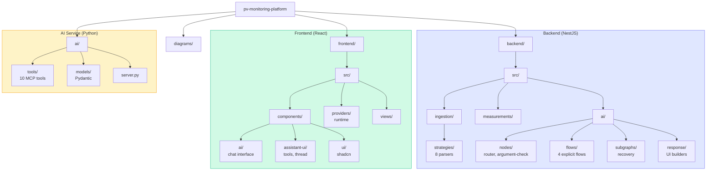

# Folder Structure

Project folder structure visualization showing backend, frontend, ai directories and their key subdirectories.

## Directory Details

| Path | Purpose |
|------|---------|
| `backend/src/ai/nodes/` | LangGraph nodes (router, argument-check) |
| `backend/src/ai/flows/` | 4 explicit flows (morning, financial, health, performance) |
| `backend/src/ai/subgraphs/` | Recovery subgraph |
| `backend/src/ai/response/` | Zod-validated UI component builders |
| `frontend/src/components/assistant-ui/` | Tool renderers (9 tools) |
| `frontend/src/providers/` | AssistantRuntime provider |
| `ai/tools/` | 10 MCP tool implementations |
