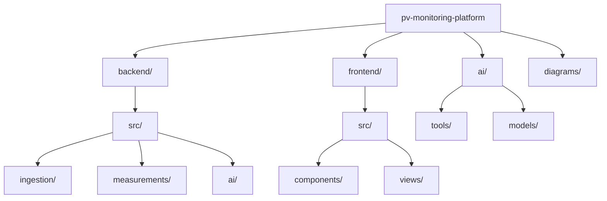

# Folder Structure

Project folder structure visualization showing backend, frontend, ai directories and their key subdirectories.

[Edit in Mermaid Chart Playground](https://mermaidchart.com/play?utm_source=mermaid_mcp_server&utm_medium=remote_server&utm_campaign=claude#pako:eNptkDEPgjAQhf8KYSfsDiZWQ-LgIsTlYKilYCO9I22FwfjfxVQQ0Ru_93rvXe-hoFKGq7BqqBcXblyQsRyDYY5EDtou0oTKkVFYR23DXUVGFzl-PEEUrQMGZy6uEsu4WCgJVIbQ_ZM2wNUP3EGpeG24tvEUw3xGCtaI8QFLPdzD0ExapwiX0gG05PZmpJbo7FId0z1NfNmviMQ7ky0I0i3hfMuonaBTsp913fjTMnBEzWR_06HR8N0vHD6e1KNxVQ)
