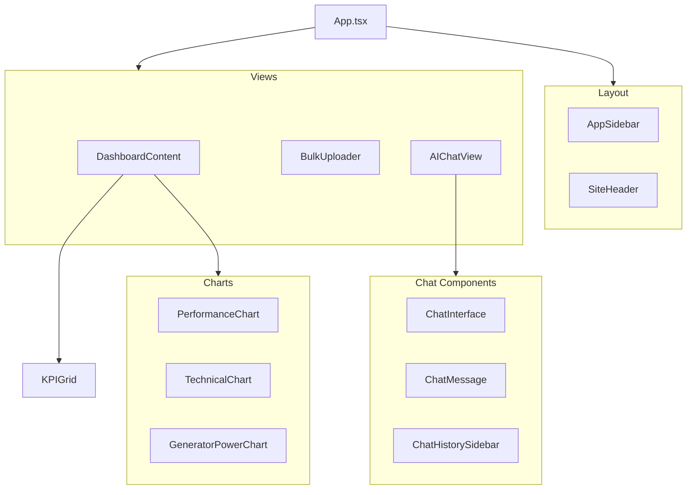

# Frontend Components

React frontend component hierarchy showing App, Layout, Views, Dashboard, Charts, and AI Chat components.

[Edit in Mermaid Chart Playground](https://mermaidchart.com/play?utm_source=mermaid_mcp_server&utm_medium=remote_server&utm_campaign=claude#pako:eNptUtFugyAU_RXDe_cBe1jSuqQz2xKTtntBH65wW8ksGMC4Ztm_D4QanCO5eOWc6z3n4jdhiiN5JOdOjawFbbPjrpKZW9u-py4erPmqKzmfZZvNU_YGNzXY5dmHwNHciWZoLhr6NjJpRWIJqQPBr4Pg2ID2XWKagC8IHDU9CIshjRhKvmoytXY9goS0xTOYtlGgOZ2zXEmL0iakU98p4HQ3dJ8hxVTItshbsDQ8fIe1kPnb0yByP0bzH_JaFtTFXgter0yEMuci1qc2StRn6jelryAZTpQEPyJrqd-kYND9RfcoqQvUYJUu1Yg6ZSQ-gse7CXsq1hLdYZBos1xdeyXdKJdaCzdefQaG1LPmt4TxjsbAJeAxTy9eGCfzNqExX_4dTjD5-QVWg9_H)
