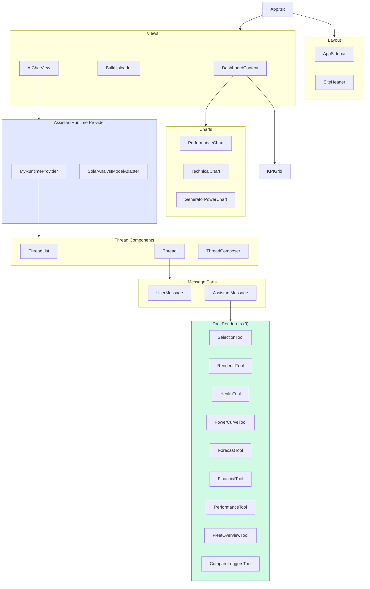

# Frontend Components

React frontend component hierarchy showing App, Layout, Views, Dashboard, Charts, and AI Chat components with @assistant-ui integration.



## Tool Renderer Details

| Tool | Component | Renders |
|------|-----------|---------|
| `request_user_selection` | SelectionTool | Dropdown, DatePicker |
| `render_ui_component` | RenderUITool | Dynamic component dispatch |
| `analyze_inverter_health` | HealthTool | HealthReport card |
| `get_power_curve` | PowerCurveTool | Composed chart |
| `forecast_production` | ForecastTool | Bar chart |
| `calculate_financial_savings` | FinancialTool | Savings card |
| `calculate_performance_ratio` | PerformanceTool | Metrics card |
| `get_fleet_overview` | FleetOverviewTool | 4-card grid |
| `compare_loggers` | CompareLoggersTool | Multi-line chart |

## Runtime Architecture

```mermaid
flowchart LR
    subgraph Provider["MyRuntimeProvider"]
        Adapter[SolarAnalystModelAdapter]
        Storage[localStorage persistence]
    end

    subgraph Adapter["Model Adapter"]
        SSE[SSE Stream Handler]
        Parse[parseSSEStream()]
        State[StreamState]
    end

    subgraph Events["SSE Events"]
        E1[text-delta]
        E2[tool-input-available]
        E3[tool-output-available]
    end

    Events --> Parse
    Parse --> State
    State --> Adapter

    style Provider fill:#e0e7ff,stroke:#6366f1
```
