# Frontend Tool Rendering

Component hierarchy and decision tree for rendering tool results in the AI chat interface.

## Component Hierarchy

## Tool Visibility Decision

## ToolUI Registration

## Tool Rendering States

## Component Mapping

## DynamicChart Types

## Selection Tool Flow

## Typing Indicator

```mermaid
flowchart TB
    subgraph Conditions["Show Typing Indicator?"]
        COND1["No text content yet"]
        COND2["No visible tool results"]
        COND3["Still streaming"]
    end

    subgraph Variants["Indicator Variants"]
        DEF["default:<br/>'Thinking...'<br/>✨ sparkles icon"]
        TOOL["tools:<br/>'Analyzing...'<br/>🔧 wrench icon"]
    end

    subgraph Animation["Animation"]
        BOUNCE["Bouncing dots"]
        PULSE["Icon pulse effect"]
    end

    COND1 --> DEF
    COND2 --> TOOL
    DEF --> Animation
    TOOL --> Animation

    style DEF fill:#fbbf24,stroke:#f59e0b
    style TOOL fill:#3b82f6,stroke:#2563eb
```

## Error Boundaries

## MetricCards Grid (FleetOverview)

```mermaid
flowchart TB
    subgraph Grid["4-Card Grid Layout"]
        C1["Total Power<br/>⚡ 45.2 kW<br/>green"]
        C2["Today's Energy<br/>🔋 312.5 kWh<br/>blue"]
        C3["Active Devices<br/>📡 8/8 online<br/>green"]
        C4["Avg Irradiance<br/>☀️ 850 W/m²<br/>yellow"]
    end

    subgraph Colors["Color Coding"]
        GREEN["green: Good/Normal"]
        YELLOW["yellow: Warning"]
        RED["red: Critical"]
        BLUE["blue: Info"]
    end

    C1 --> GREEN
    C2 --> BLUE
    C3 --> GREEN
    C4 --> YELLOW

    style C1 fill:#22c55e,stroke:#16a34a,color:#fff
    style C2 fill:#3b82f6,stroke:#2563eb,color:#fff
    style C3 fill:#22c55e,stroke:#16a34a,color:#fff
    style C4 fill:#f59e0b,stroke:#d97706,color:#fff
```

