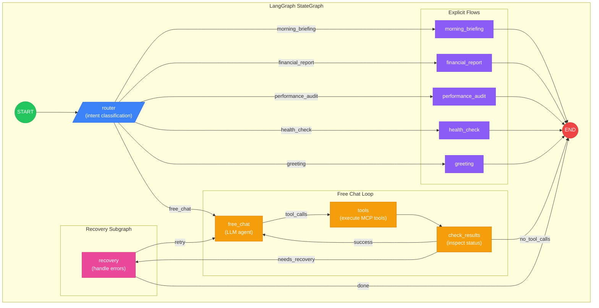
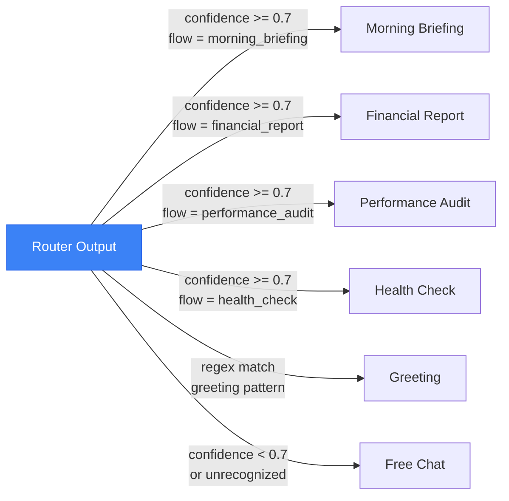

# LangGraph Main Graph

Complete StateGraph structure showing the AI agent's main orchestration flow with router-based intent classification, explicit flows, free chat fallback, and recovery subgraph integration.

## Node Descriptions

| Node | Type | Purpose |
|------|------|---------|
| **router** | Classification | Two-tier intent detection (regex + LLM) |
| **morning_briefing** | Explicit Flow | Fleet overview with critical alerts |
| **financial_report** | Explicit Flow | Savings calculation + forecast |
| **performance_audit** | Explicit Flow | Multi-logger comparison |
| **health_check** | Explicit Flow | Anomaly detection |
| **greeting** | Explicit Flow | Time-aware welcome (no LLM) |
| **free_chat** | Agent Loop | Classic LLM + tools for ad-hoc queries |
| **tools** | Tool Executor | Execute MCP tools via HTTP |
| **check_results** | Guard | Inspect tool status for recovery needs |
| **recovery** | Subgraph | Handle no_data, date selection, errors |

## Conditional Routing

## State Schema

The graph uses `ExplicitFlowStateAnnotation` with these key fields:

- **messages**: Full conversation history (LangChain BaseMessage[])
- **recoveryAttempts**: Counter for retry loop guard (max 3)
- **pendingUiActions**: Pass-through tool calls for frontend
- **activeFlow**: Current workflow identifier
- **flowStep**: Position within a flow
- **flowContext**: Accumulated selections, tool results, preferences
