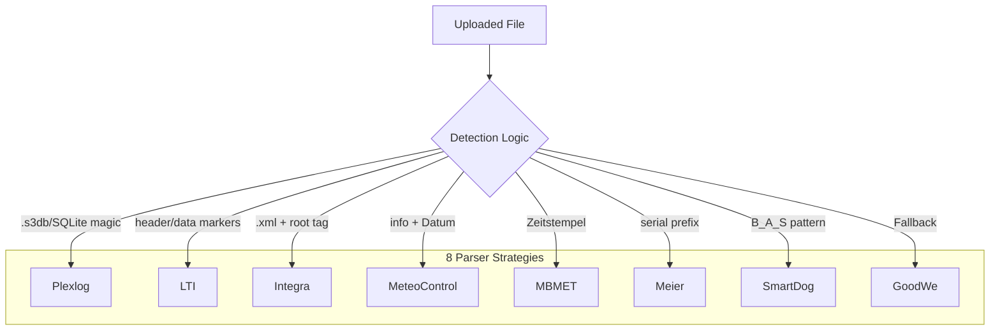

# Parser Strategy

Parser strategy pattern diagram showing file detection logic and 8 parser strategies.

[Edit in Mermaid Chart Playground](https://mermaidchart.com/play?utm_source=mermaid_mcp_server&utm_medium=remote_server&utm_campaign=claude#pako:eNptkEFrAjEQhf_KsNdiPfRSeijUWougYFlLoa7IuJldg9lkSUYqGP97E7cqkr5LkpmPmbx3yEojKHvKKmV-yg1ahvmg0BA0kooWn60yKEicXstCX1vQ6z3DkJhKPnSHNBomppbl8cx19Uj6e_cg1v38YyKZoMFAeZgp2itTJ-yGwkrbF8gYULsl6zxM5uN06L5RcAfWGAbG2sNYM9UWE1DqygRwiLxrPExDw7wazdaoBP0myY6paUkFcjB9myeIIytRQWupkvs4TpJNoMHqZZVDi8xktYc8GOHhP2ZHqNQay62Hd2PEF52zc7t1cNJuYIY2LHSLInv8u0POFoNRSa7Ilh0edZNn1CWzqJtsotIYTtWr5Q66mIu6tRF1_nW8kxbZ8RcmmrxY)
