# Recovery Subgraph

Detailed flow diagram for the recovery subgraph: handling data errors with date selection, alternative suggestions, and error explanation.

## Main Flow


## Sequence Diagram - Date Selection Recovery

```mermaid
sequenceDiagram
    participant F as Flow
    participant T as Tool
    participant R as RecoverySubgraph
    participant FE as Frontend
    participant U as User

    F->>T: get_power_curve("925", "2025-01-15")
    T-->>F: { status: "no_data_in_window",<br/>availableRange: { start: "2024-12-01", end: "2025-01-10" } }

    rect rgb(254, 243, 199)
        Note over F,R: Enter Recovery
        F->>R: detect_recovery_type()
        R->>R: Check recoveryAttempts (0 < 3) ✓
        R->>R: Increment to 1
    end

    rect rgb(219, 234, 254)
        Note over R,FE: Date Selection
        R->>FE: request_user_selection({<br/>  inputType: "date",<br/>  minDate: "2024-12-01",<br/>  maxDate: "2025-01-10"<br/>})
        FE-->>U: Show date picker
        U->>FE: Select "2025-01-05"
        FE->>R: selectedDate = "2025-01-05"
    end

    rect rgb(220, 252, 231)
        Note over R,F: Retry with New Date
        R->>F: Update flowContext.selectedDate
        R->>F: Return to flow
    end

    F->>T: get_power_curve("925", "2025-01-05")
    T-->>F: { status: "ok", result: {...} }
```



## Recovery Types

### no_data_in_window

Data exists for the logger, but not in the requested date range.


### no_data

Logger has no data at all in the database.


### error

Tool execution failed due to system error.


## Recovery Guard

Prevents infinite retry loops:


## Date Selection UI

```mermaid
flowchart TB
    subgraph DatePicker["Date Selection Component"]
        PROMPT["No data available for January 15.<br/>Please select a date within the available range:"]

        subgraph Picker["Date Picker"]
            MIN["Min: December 1, 2024"]
            MAX["Max: January 10, 2025"]
            CAL["📅 Calendar Widget"]
        end

        subgraph FlowHint["Flow Hint"]
            NEXT["Will retry the analysis<br/>with your selected date"]
            SKIP["Quick option: Use latest<br/>available (January 10)"]
        end
    end

    style PROMPT fill:#f59e0b,stroke:#d97706
    style SKIP fill:#d1fae5,stroke:#10b981
```



## State Updates

After recovery completes:

```typescript
// Before recovery
flowContext: {
  selectedLoggerId: "925",
  selectedDate: "2025-01-15"  // Invalid date
}

// After recovery (date selection)
flowContext: {
  selectedLoggerId: "925",
  selectedDate: "2025-01-05",  // Valid date from user
  toolResults: {
    needsRecovery: false
  }
}
recoveryAttempts: 1  // Incremented
```
