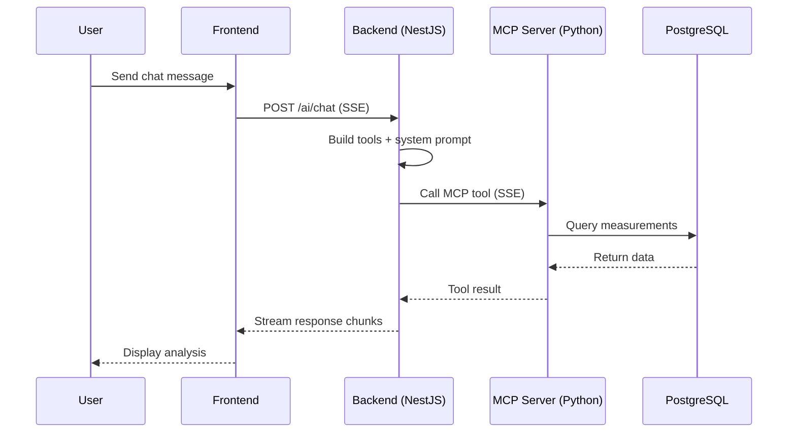

# Request Sequence

Sequence diagram showing the request flow from User to Frontend to Backend to MCP Server to PostgreSQL and back.

[Edit in Mermaid Chart Playground](https://mermaidchart.com/play?utm_source=mermaid_mcp_server&utm_medium=remote_server&utm_campaign=claude#pako:eNptj7Fug0AMhl_FYqKqouwMGQhlqEJLStiyWGAlpxx39OyrhKq-e-9C0laiXr_P_n9_Jp3tKckSpndPpqNC4cnhcDQQZkQnqlMjGoEWkKFlcktURlQ6a4RMv8R5xDl2l0AhfSGW5-ZhqVVRq7Y1NOQ-yEFaT3K25h-ziGZtWU6Omv3uaGalXW02ZRbWQ0x3RoGBmPFEMy0DzTOoX5sDrFGtr0baNE-3gHzmuVe6B7FWMzwCTyw0wOjsMMqvV2WwRa2vbaP6904VeJHB3pObQgNk72ggIzzjYjXvv5F4Z6BHwfveXOAQ7zlir38Cb3-JIxwiGq1hCi96c-H7c8FpMygUjxonQIN6YsXJ1zdZXJiW)
