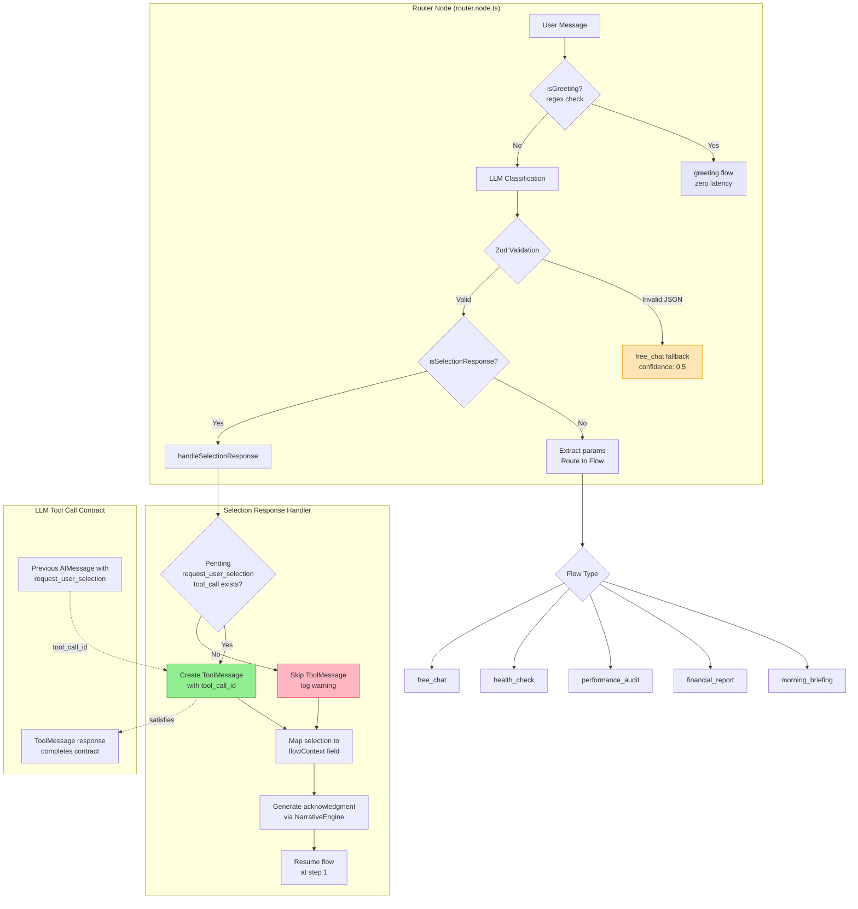

# Router Logic Flow

Shows the two-tier classification system and ToolMessage injection for selection handling.

## Diagram

## Key Components

### Two-Tier Classification

1. **Tier 1: Regex Greeting Detection** (`isGreeting()`)
   - 7 regex patterns for common greetings
   - Anchored patterns prevent false positives
   - Zero LLM latency for simple greetings

2. **Tier 2: LLM Classification**
   - Full intent analysis with parameter extraction
   - Zod schema validation for type safety
   - Context-aware prompting when waiting for selection

### Selection Response Handling

When `isSelectionResponse=true` and user provides valid selection:

1. Find pending `request_user_selection` tool call in message history
2. **STRICT ID MATCHING**: Only create ToolMessage if valid `tool_call_id` exists
3. Map selection to appropriate `flowContext` field:
   - `loggerId` → `selectedLoggerId`
   - `loggerIds` → `selectedLoggerIds`
   - `date` → `selectedDate`
   - `dateRange` → `dateRange`
4. Generate acknowledgment message
5. Resume flow at step 1 (past argument check)

### Tool Call Contract

LLM providers (OpenAI, Anthropic, Gemini) expect every `tool_call` in an AIMessage to have a corresponding ToolMessage response. The router satisfies this contract by:

- Finding the pending tool call with matching ID
- Creating a properly formatted ToolMessage
- Including selection data in the content

## Code Reference

- Router node: `backend/src/ai/nodes/router.node.ts`
- Key function: `handleSelectionResponse()` (lines 396-488)
- Classification schema: `FlowClassificationSchema` in `types/flow-state.ts`
