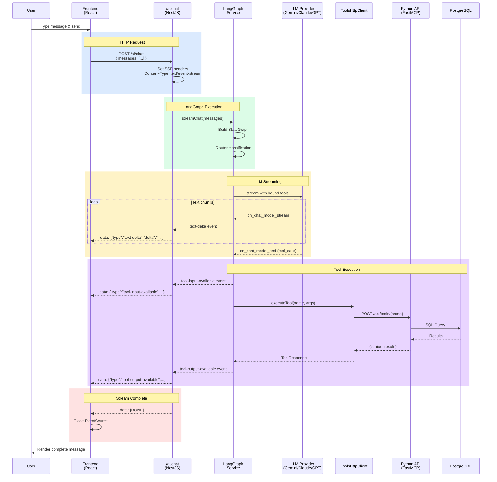
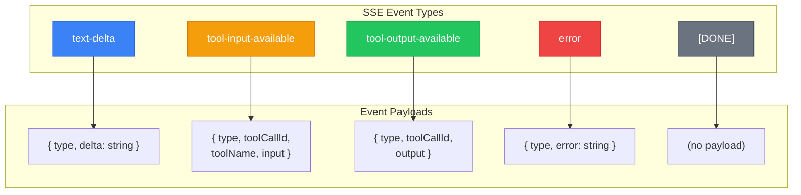
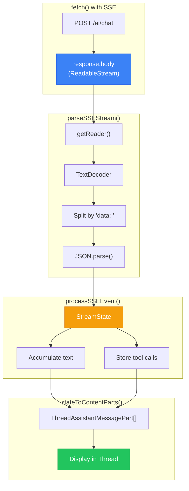
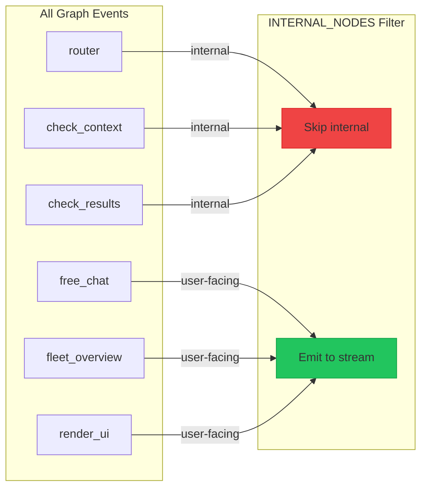
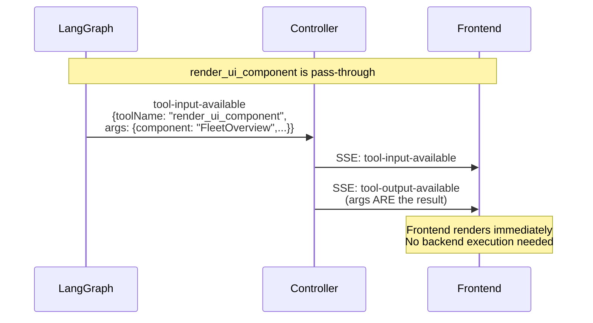
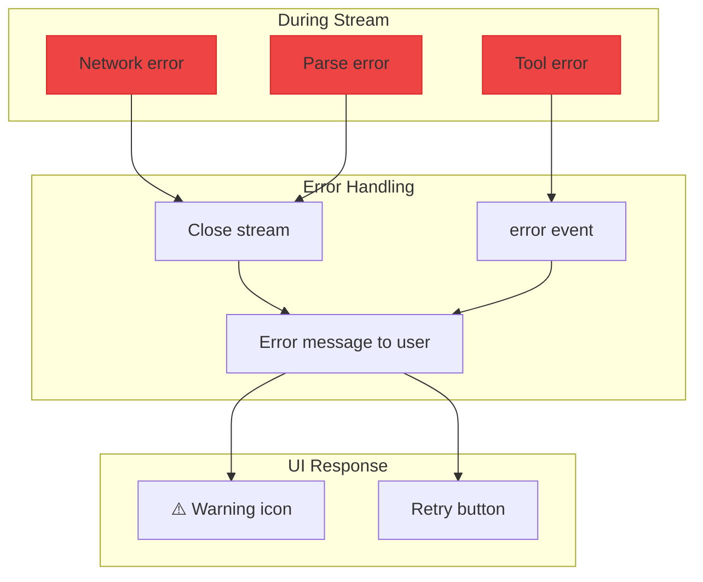
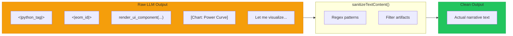

# SSE Streaming

Sequence diagram for Server-Sent Events streaming from user input through the full stack to database and back.

## Full Stack Flow



## SSE Event Types



## Example SSE Stream

```
data: {"type":"text-delta","delta":"Let me "}

data: {"type":"text-delta","delta":"check the "}

data: {"type":"text-delta","delta":"health of "}

data: {"type":"text-delta","delta":"logger 925."}

data: {"type":"tool-input-available","toolCallId":"call_abc123","toolName":"analyze_inverter_health","input":{"logger_id":"925","days":7}}

data: {"type":"tool-output-available","toolCallId":"call_abc123","output":{"status":"ok","result":{"anomalies":[],"healthScore":95}}}

data: {"type":"text-delta","delta":"Great news! "}

data: {"type":"text-delta","delta":"Logger 925 is healthy."}

data: [DONE]
```

## Frontend Stream Processing



## LangGraph Event Filtering

Internal nodes are filtered from stream output:



## Pass-Through Tools

UI tools emit both input and output immediately:



## Error Handling



## Text Sanitization

Frontend removes LLM artifacts:


