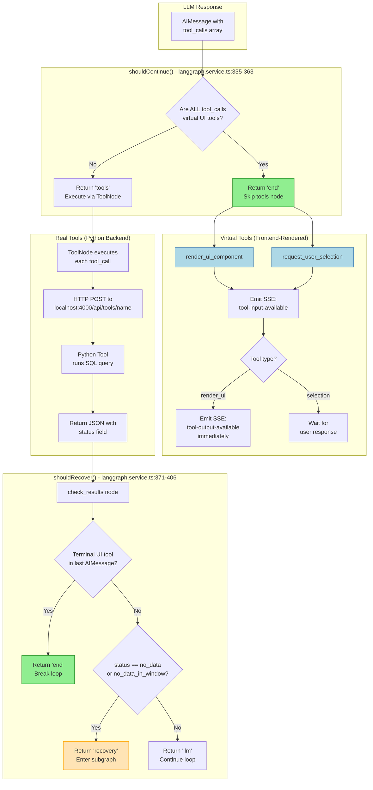

# Tool Execution Flow

Shows how LangGraph handles virtual UI tools vs real Python backend tools.

## Diagram



## Tool Categories

### Virtual Tools (Pass-Through)

These tools have **no backend implementation**. The LLM arguments are passed directly to the frontend for rendering.

| Tool | Purpose | Terminal? |
|------|---------|-----------|
| `render_ui_component` | Render charts, cards, reports | Yes |
| `request_user_selection` | Dropdowns, date pickers | Yes (waits for input) |

### Real Tools (Python Backend)

Executed via HTTP POST to the Python MCP service at `localhost:4000`.

| Tool | Category | Endpoint |
|------|----------|----------|
| `list_loggers` | Discovery | `/api/tools/list_loggers` |
| `get_fleet_overview` | Discovery | `/api/tools/get_fleet_overview` |
| `analyze_inverter_health` | Monitoring | `/api/tools/analyze_inverter_health` |
| `get_power_curve` | Monitoring | `/api/tools/get_power_curve` |
| `compare_loggers` | Comparison | `/api/tools/compare_loggers` |
| `calculate_financial_savings` | Financial | `/api/tools/calculate_financial_savings` |
| `calculate_performance_ratio` | Performance | `/api/tools/calculate_performance_ratio` |
| `forecast_production` | Forecasting | `/api/tools/forecast_production` |
| `diagnose_error_codes` | Diagnostics | `/api/tools/diagnose_error_codes` |

## Key Design Decisions

### 1. Virtual Tool Detection (`shouldContinue`)

```typescript
const onlyVirtualTools = toolCalls.every(
  (tc) =>
    tc.name === 'render_ui_component' ||
    tc.name === 'request_user_selection',
);

if (onlyVirtualTools) {
  return 'end';  // Skip tools node entirely
}
```

**Why?** Virtual tools have no `_call()` implementation in the ToolNode. Routing to tools node would cause "tool not found" errors.

### 2. Terminal Tool Detection (`shouldRecover`)

```typescript
const hasTerminalUiTool = toolCalls.some(
  (tc) =>
    tc.name === 'render_ui_component' ||
    tc.name === 'request_user_selection',
);

if (hasTerminalUiTool) {
  return 'end';  // Break the loop
}
```

**Why?** UI tools signal "end of turn" - the assistant has produced output for the user. Continuing would cause infinite loops.

### 3. Immediate Output Emission

For `render_ui_component`, we emit `tool-output-available` immediately after `tool-input-available`:

```typescript
if (toolCall.name === 'render_ui_component') {
  yield { type: 'tool-output-available', toolCallId, output: toolCall.args };
}
```

**Why?** The args ARE the result for pass-through tools. No backend execution needed.

## SSE Event Flow

```
1. LLM generates AIMessage with tool_calls
2. shouldContinue() checks tool types
3a. Virtual only:
    → emit tool-input-available
    → emit tool-output-available (for render_ui)
    → END
3b. Has real tools:
    → ToolNode executes via HTTP
    → emit tool-output-available with result
    → shouldRecover() checks for:
        - Terminal UI tools → END
        - Data errors → recovery subgraph
        - Otherwise → continue LLM loop
```

## Code Reference

- Main graph: `backend/src/ai/langgraph.service.ts`
- `shouldContinue()`: lines 335-363
- `shouldRecover()`: lines 371-406
- Tool definitions: `backend/src/ai/langchain-tools.ts`
- HTTP client: `backend/src/ai/tools-http.client.ts`
