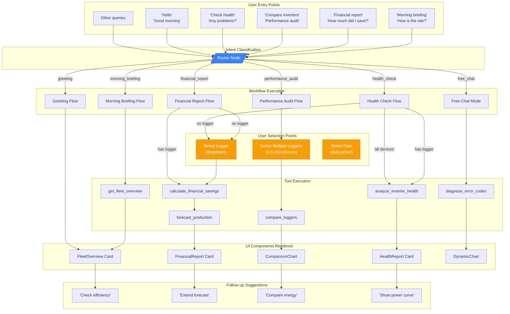
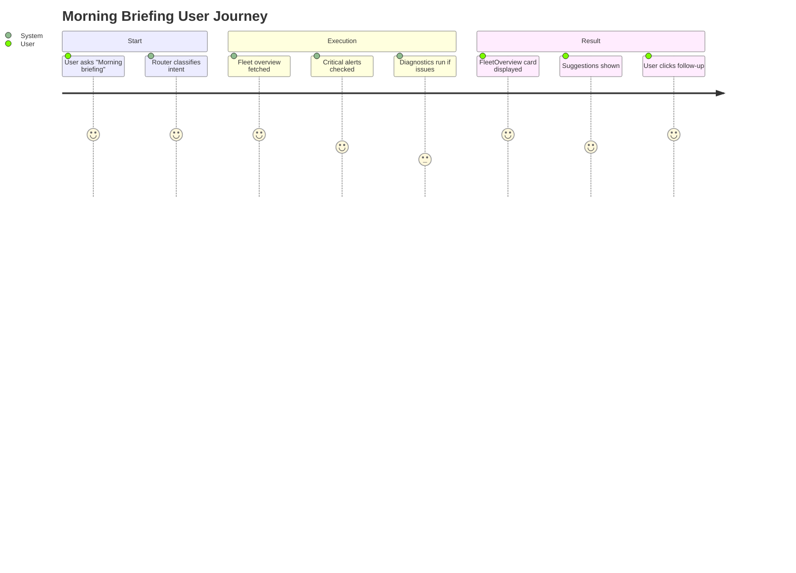
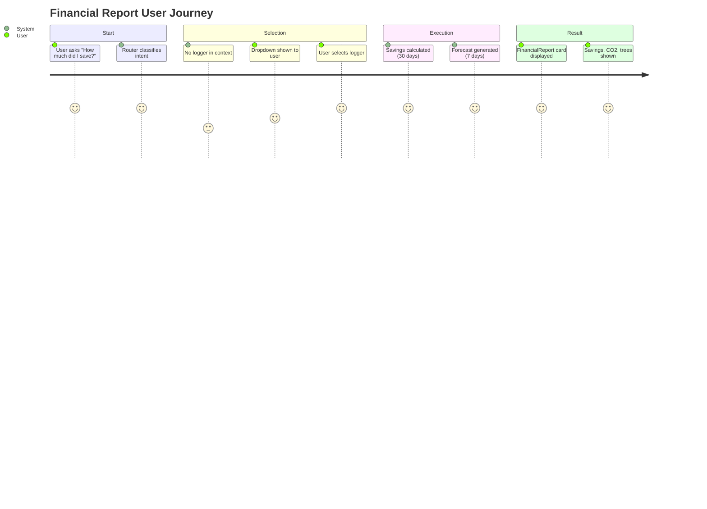

# User Flows

User journey through the AI assistant's explicit workflows, showing entry points, decision points, tool executions, and UI component rendering.

## User Journey Details

### Morning Briefing Journey

### Financial Report Journey

## Decision Points

| Flow | Decision Point | Options | Outcome |
|------|----------------|---------|---------|
| Financial Report | Logger selected? | Yes / No | Skip selection / Show dropdown |
| Health Check | Logger selected? | Yes / No | Skip selection / Show dropdown |
| Health Check | "All devices" intent? | Yes / No | Analyze all / Analyze single |
| Performance Audit | Loggers selected? | 2-5 selected | Proceed to compare |
| Any Flow | Tool returns no_data? | Yes / No | Show recovery / Show results |
