# Frontend - React Dashboard

React 19 + Vite 7 frontend with shadcn/ui components and AI chat interface.

## Tech Stack

- **Framework**: React 19, TypeScript
- **Build**: Vite 7
- **Styling**: Tailwind CSS 4, shadcn/ui
- **Chat Primitives**: @assistant-ui/react
- **Charts**: Recharts 3.x
- **Animation**: Framer Motion 12.x
- **Icons**: Lucide React
- **Date Handling**: date-fns + react-day-picker

## Component Structure



```
src/
├── components/
│   ├── layout/           # AppSidebar, SiteHeader, NavMain
│   ├── dashboard/        # Charts, KPIGrid, DashboardControls
│   ├── ai/               # ChatInterface, ChatMessage, ToolRenderer
│   │   ├── chat-interface.tsx    # Main chat UI with SSE streaming
│   │   ├── chat-message.tsx      # Message rendering with tool visibility
│   │   ├── tool-renderer.tsx     # Tool result visualization
│   │   ├── selection-prompt.tsx  # Dropdowns and date pickers
│   │   ├── metric-card.tsx       # KPI display cards
│   │   ├── status-badge.tsx      # Health/status indicators
│   │   ├── typing-indicator.tsx  # Loading states
│   │   ├── chat-error.tsx        # Error display and retry
│   │   └── workflow-card.tsx     # Quick-start workflow buttons
│   ├── assistant-ui/     # @assistant-ui/react primitives
│   │   ├── thread.tsx            # Chat thread with auto-scroll
│   │   ├── thread-list.tsx       # Conversation sidebar
│   │   └── markdown.tsx          # Markdown rendering
│   └── ui/               # shadcn/ui components
├── views/                # Page views (ai-chat-view.tsx)
├── hooks/                # Custom hooks (use-ai-chat.ts)
├── lib/                  # Utilities (date-utils, cn)
└── types/                # TypeScript types
```

## Views

| View | Description |
|------|-------------|
| Dashboard | Logger data visualization with adaptive KPIs |
| Upload | Bulk file uploader with drag-n-drop |
| AI Chat | Chat interface with tool visualization |
| Reports | Data export and reporting |

## AI Chat Features


### Assistant-UI Integration

The chat interface uses `@assistant-ui/react` for robust chat primitives:

- **ThreadList**: Conversation history sidebar with rename/delete
- **Thread**: Main chat viewport with auto-scroll
- **Composer**: Message input with submit handling
- **Runtime Provider**: Connects to backend SSE streaming via custom adapter

Components in `src/components/assistant-ui/` wrap the library primitives with custom styling and integrate with the backend's LangGraph-powered responses.

### SSE Streaming Protocol

The chat interface receives Server-Sent Events from the backend:

| Event Type | Payload | Description |
|------------|---------|-------------|
| `text-delta` | `{ delta: string }` | Incremental text from LLM |
| `tool-input-available` | `{ toolCallId, toolName, input }` | Tool call initiated |
| `tool-output-available` | `{ toolCallId, output }` | Tool execution result |
| `[DONE]` | - | Stream complete signal |

### Tool Visibility Strategy

Tools are categorized for clean UX - users see results while "plumbing" stays hidden:

**Hidden Tools** (shown in debug panel only):
- `list_loggers` - Logger discovery
- `analyze_inverter_health` - Anomaly detection
- `get_power_curve` - Timeseries extraction
- `compare_loggers` - Multi-logger comparison
- `calculate_financial_savings` - ROI calculation
- `calculate_performance_ratio` - Efficiency metrics
- `forecast_production` - Production prediction
- `diagnose_error_codes` - Error interpretation
- `get_fleet_overview` - Site-wide status

**Visible Tools** (rendered inline):
- `render_ui_component` - Charts, cards, reports
- `request_user_selection` - Dropdowns, date pickers

### Loading States

| State | Indicator | When |
|-------|-----------|------|
| Thinking | Amber sparkles + bouncing dots | No content yet |
| Analyzing | Blue wrench + bouncing dots | Hidden tools executing |
| Streaming | Text appearing | Text deltas arriving |

### Follow-up Suggestions

Context-aware suggestions appear after tool completion:

```typescript
// Example: After analyze_inverter_health completes
[
  { label: "Show power curve", priority: "primary" },
  { label: "Diagnose errors", priority: "secondary" }  // Only if anomalies found
]
```

### Chat History Persistence

Conversations persist in localStorage (`solar-analyst-chats`):
- Auto-generated titles from first message (50 chars)
- Grouped by date (Today, Yesterday, Last 7 Days, Older)
- Delete with confirmation

### Quick-Start Workflows

4 workflow cards for common tasks:
- Morning Briefing - Fleet overview
- Financial Report - Savings analysis
- Performance Audit - Logger comparison
- Health Check - Anomaly detection

### Error Recovery

| Error Type | Display | Recovery |
|------------|---------|----------|
| Network | Red alert | Retry button |
| Timeout (60s) | Clock icon | Retry button |
| API error | Warning icon | Retry button |

## Charts

- **PerformanceChart**: Power and irradiance over time
- **TechnicalChart**: Secondary metrics (temperature, etc.)
- **GeneratorPowerChart**: Power generation visualization
- **DynamicChart**: AI-generated charts via tool results

## Development

```bash
npm install
npm run dev       # Development server (HMR)
npm run build     # Production build
npm run preview   # Preview production build
npm run lint      # ESLint check
```

## Key Dependencies

- `react` 19.x - UI framework
- `vite` 7.x - Build tool
- `@assistant-ui/react` - Chat primitives and thread management
- `recharts` - Charting library
- `framer-motion` - Animations
- `date-fns` - Date utilities
- `react-day-picker` - Calendar component
- `lucide-react` - Icons

## Environment

Frontend connects to:
- Backend API: `http://localhost:3000`
- Vite dev server: `http://localhost:5173`

API proxy configured in `vite.config.ts` for `/api` routes.

## Related Documentation

- [AI_UX_FLOWS.md](../AI_UX_FLOWS.md) - Complete AI architecture and UX flow specifications
- [CLAUDE.md](../CLAUDE.md) - Coding standards and patterns
