# Frontend - React Dashboard

React 19 + Vite 7 frontend with shadcn/ui components and AI chat interface.


## Tech Stack

| Category | Technology |
|----------|------------|
| Framework | React 19, TypeScript, Vite 7 |
| Styling | Tailwind CSS 4, shadcn/ui (Radix UI) |
| Chat | @assistant-ui/react, assistant-stream |
| Charts | Recharts 3.x |
| Animation | Framer Motion 12.x |
| Icons | Lucide React |
| Dates | date-fns, react-day-picker |

## Key Architectural Decisions

### 1. Multi-Thread Chat with assistant-ui

Uses `@assistant-ui/react` runtime with custom adapters for:
- **SolarAnalystModelAdapter**: Converts messages to backend format, streams SSE responses
- **LocalStorageThreadListAdapter**: Persists conversation list with rename/archive/delete
- **ThreadHistoryAdapter**: Per-thread message persistence with parent chain validation

```
src/providers/assistant-runtime-provider.tsx  # Runtime configuration
src/components/assistant-ui/thread.tsx        # Main chat interface
src/components/assistant-ui/thread-list.tsx   # Conversation sidebar
```

### 2. SSE Streaming Adapter Pattern

Custom adapter in `lib/assistant-stream-adapter.ts` parses backend SSE events:
- Accumulates `text-delta` events into single message parts
- Tracks tool calls by ID, appends outputs when available
- Sanitizes LLM artifacts (JSON objects, Ollama markers, placeholder text)

### 3. Tool Visibility Strategy

Tools categorized for clean UX - data fetching hidden, results visible:



**Hidden** (debug panel): `list_loggers`, `analyze_inverter_health`, `get_power_curve`, `compare_loggers`, `calculate_financial_savings`, `calculate_performance_ratio`, `forecast_production`, `diagnose_error_codes`, `get_fleet_overview`

**Visible** (inline): `render_ui_component` (charts, cards), `request_user_selection` (dropdowns, pickers)

### 4. localStorage Persistence

Conversations persist across sessions:
- `solar-analyst-threads-metadata`: Thread list (titles, archived status)
- `solar-analyst-threads-{id}`: Message history per thread
- Auto-generated titles from first message (50 chars max)

### 5. Stable Callback References

`App.tsx` uses `useRef` + `useCallback` pattern to prevent child re-renders during uploads. `BulkUploader` receives stable `onUploadComplete` callback.

## Component Structure

```
src/
├── components/
│   ├── layout/              # AppSidebar, SiteHeader, NavMain, NavLoggers
│   ├── dashboard/           # KPIGrid, PerformanceChart, TechnicalChart, DashboardControls
│   ├── assistant-ui/        # Chat primitives and tool renderers
│   │   ├── thread.tsx              # Main chat with auto-scroll
│   │   ├── thread-list.tsx         # Conversation sidebar
│   │   ├── assistant-message.tsx   # Message with tool handling
│   │   ├── markdown-text.tsx       # Markdown + math + code blocks
│   │   └── tools/                  # 9 tool-specific renderers
│   │       ├── render-ui-tool.tsx      # Dynamic charts/cards
│   │       ├── selection-tool.tsx      # Dropdowns, date pickers
│   │       ├── power-curve-tool.tsx    # Time-series visualization
│   │       └── ...                     # health, financial, forecast, etc.
│   └── ui/                  # shadcn/ui base components
├── views/                   # Page views (ai-chat-view.tsx)
├── providers/               # assistant-runtime-provider.tsx
├── hooks/                   # use-ai-chat.ts, use-mobile.ts
├── lib/                     # assistant-stream-adapter.ts, date-utils.ts, text-sanitizer.ts
└── types/                   # logger.ts (8 types + config), view-mode.ts
```

## Views

| View | Description |
|------|-------------|
| Dashboard | Logger data visualization with adaptive KPIs (inverter vs meteo) |
| Upload | Bulk file uploader with drag-n-drop folder support |
| AI Chat | Multi-thread chat with tool visualization |
| Reports | Data export and reporting |

## AI Chat Integration


### SSE Protocol

| Event | Payload | Description |
|-------|---------|-------------|
| `text-delta` | `{ delta: string }` | Incremental text from LLM |
| `tool-input-available` | `{ toolCallId, toolName, input }` | Tool call initiated |
| `tool-output-available` | `{ toolCallId, output }` | Tool execution result |
| `[DONE]` | - | Stream complete |

### Loading States

| State | Indicator | When |
|-------|-----------|------|
| Thinking | Amber sparkles | No content yet |
| Analyzing | Blue wrench | Hidden tools executing |
| Streaming | Text appearing | Text deltas arriving |

### Quick-Start Workflows

4 workflow cards: Morning Briefing, Financial Report, Performance Audit, Health Check

## Development

```bash
npm install
npm run dev       # Dev server with HMR (port 5173)
npm run build     # Production build
npm run lint      # ESLint check
```

## Environment

- Backend API: `http://localhost:3000`
- Dev server: `http://localhost:5173`
- API proxy: `/api` routes proxied in `vite.config.ts`

## Diagrams

| Diagram | Description |
|---------|-------------|
| [Frontend Components](../diagrams/svg/frontend-components.svg) | Component hierarchy |
| [AI Chat Flow](../diagrams/svg/ai-chat-flow.svg) | Chat sequence |
| [Tool Rendering](../diagrams/svg/frontend-tool-rendering.svg) | Tool UI components |
| [SSE Streaming](../diagrams/svg/sse-streaming.svg) | Event streaming |
| [User Flows](../diagrams/svg/user-flows.svg) | User journeys |

## Related Documentation

- [AI_UX_FLOWS.md](../AI_UX_FLOWS.md) - Complete AI architecture specs
- [CLAUDE.md](../CLAUDE.md) - Coding standards
